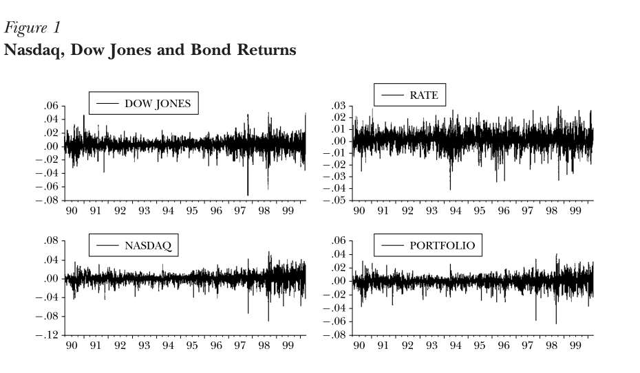
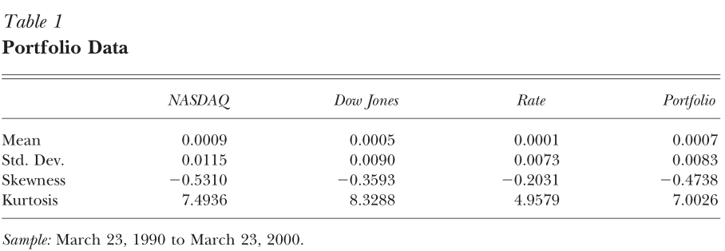
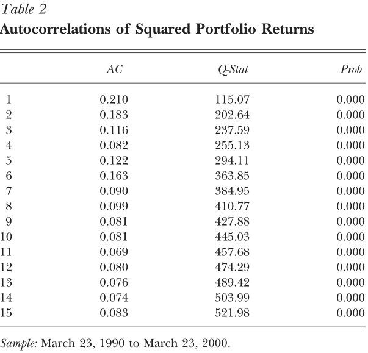
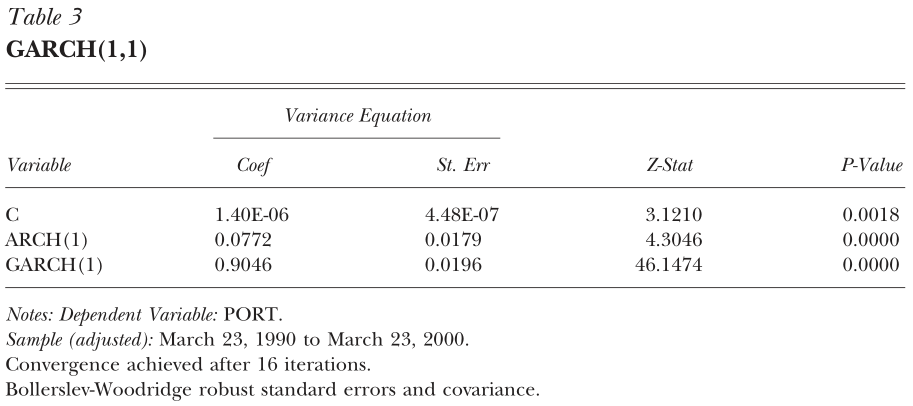
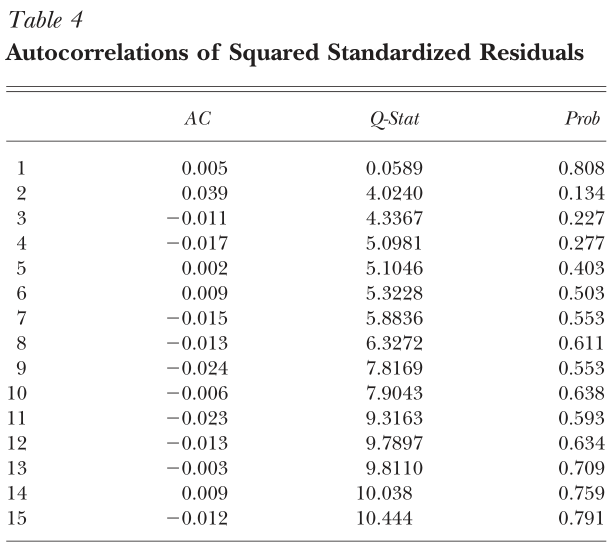
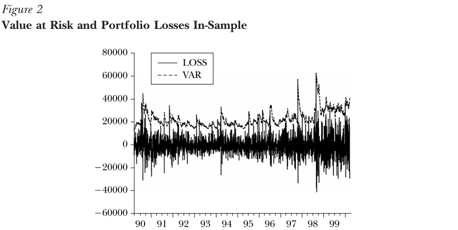
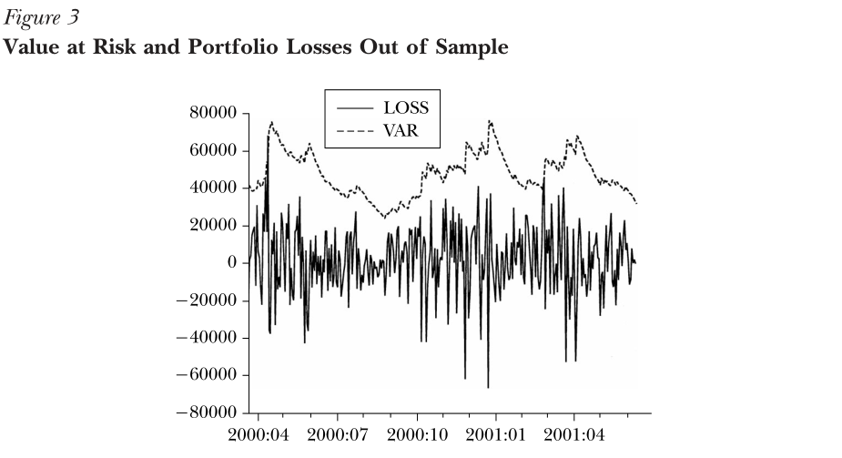

应用计量经济学的主要工具是最小二乘模型。这是一个很自然的选择，因为应用计量经济学
家通常被要求确定一个变量会随着其他变量的变动而变动多少。然而，越来越多的计量经济
学家被要求预测和分析模型的误差大小。在这种情况下，波动性是需要研究的问题，
ARCH/GARCH模型成为了标准的工具。

最小二乘模型的基本假设是假定所有误差项的期望值，当平方时，在任何给定点是相同的。
这个假设被称为同方差性，这也是ARCH/GARCH模型的重点。误差项的方差不相等的数据，其
误差项对于数据的某些点或范围可能比其他点或范围更大，这种数据被称为异方差性。标准
的警告是，在异方差存在的情况下，普通最小二乘回归的回归系数仍然是无偏的，但传统方
法估计的标准误差和置信区间过于狭窄，给人一种精度错误的感觉。ARCH和GARCH模型将异
方差视为需要建模的方差，而不是将其视为需要修正的问题。因此，不仅修正了最小二乘的
不足，而且计算了每个误差项的方差预测。这种预测往往会引起人们的兴趣，尤其是在金融
领域的应用。

异方差的警告通常只适用于横截面模型，而不适用于时间序列模型。例如，如果观察家庭数
据中收入和消费之间的横截面关系，人们可能会发现低收入家庭的消费比高收入家庭的消费
与收入的关系更密切，因为贫困家庭的储蓄或赤字的绝对值可能比高收入家庭小得多。在家
庭消费对收入的横截面回归中，高收入家庭的误差项似乎比低收入家庭的绝对值系统地更
大，而同方差性的假设似乎是不合理的。相比之下，如果看一个总时间序列的消费函数，比
较国民收入和消费，假设误差项的方差随着时间变化不大似乎更合理

最近在标准误差估计方面的一项发展，即所谓的“稳健标准误差”，也减少了对异方差的关
注。在样本容量较大的情况下，稳健标准误差在具有异方差的情况下仍能给出一个很好的标
准误差估计。如果样本很小，是否需要进行不影响系数的异方差校正，只对标准误差进行渐
近校正，这是有争议的。

然而，有时应用计量经济学家所面临的自然问题是模型预测的准确性。在这种情况下，关键
问题是误差项的方差以及使它们变大的原因。这个问题经常出现在金融应用中，因变量是资
产或投资组合的回报，回报的方差代表这些回报的风险水平。这些都是时间序列的应用，但
异方差仍然是一个问题。甚至粗略地看一下金融数据就会发现，某些时期的风险高于其他时
期;也就是说，误差项的大小的期望值有时大于另一些时候。此外，这些风险时期并不是随
机分布在季度或年度数据中。相反，金融回报的风险存在一定程度的自相关。金融分析师观
察如图1所示的每日收益图，注意到收益的幅度随时间变化，并将其描述为“波动聚集”。代
表自回归条件异方差性和广义自回归条件异方差性的ARCH和GARCH模型就是为了解决这类问
题而设计的。它们已成为处理时间序列异方差模型的广泛工具。这些模型的目标是提供一种
波动率度量——就像标准偏差一样——用于有关风险分析、投资组合选择和衍生品定价的金融决
策。

# ARCH/GARCH 模型

由于本文将重点讨论金融应用，因此我们将使用金融符号。因变量设为$r_t$，可以是资产
或投资组合的收益。均值$m$和方差$h$将定义相对于过去的信息集合,当前返回的$r$等于
$r$的均值(即$r$的期望值基于过去信息)+ $r$的标准偏差(即方差的平方根)乘以本期的误
差项。

计量经济学所面临的挑战是如何在过去信息的条件下，详细说明如何使用这些信息来预测收
益的均值和方差。虽然人们已经考虑了许多关于平均收益的规范，并试图用它们来预测未来
收益，但在引入ARCH模型之前，几乎没有任何方法可以计算方差。主要的描述工具是滚动标
准差。这是用固定数量的最新观测值计算出的标准偏差。例如，这可以使用最近一个月(22
个工作日)的数据每天计算。我们可以把这个公式看作是第一个ARCH模型;它假设明天收益的
方差是过去22天残差平方的等加权平均值。相等权重的假设似乎没有吸引力，因为人们会认
为最近的事件更相关，因此权重应该更高。此外，一个月以上观测的零权假设也没有吸引
力。Engle(1982)提出的ARCH模型将这些权重作为估计的参数。因此，该模型允许数据确定
用于预测方差的最佳权值。

Bollerslev(1986)引入的GARCH参数化是对该模型的一个有用的推广。这个模型也是过去残
差平方的加权平均值，但它的权重在下降，而且永远不会完全降到零。它给出了易于估计的
简约模型，即使以最简单的形式，也已被证明在预测条件方差方面出奇地成功。使用最广泛
的GARCH规范断言,在未来时期的最佳预测方差的加权平均长期平均方差,方差图1纳斯达克,
道琼斯和债券回报罗伯特·恩格尔159预测这一时期和新的信息在这个时期被最近的平方剩
余。这种更新规则是对自适应或学习行为的简单描述，可以认为是贝叶斯更新。

想想看，一个交易员知道标准普尔500指数的长期平均日标准差是1%，他昨天做的预测是
2%，而今天观察到的意外回报是3%。显然，这是一个高波动期，今天尤其不稳定，这表明对
明天的预测可能更高。然而，长期平均值只有1%的事实可能会导致预测者降低预测。最好的
策略取决于天数之间的依赖性。如果这三个数字的平方和权重相等，那么新的预测值将是
$2.16=\sqrt{(1+4+9)/3}$。然而，比起对这些数据进行同等的加权，人们通常发现每日数
据的加权，如(0.02，0.9，0.08)更准确。因此预测是
$2.08=\sqrt{0.02\ast1+0.9\ast4+0.08\ast9}$

精确地说，我们可以使用$h_t$来定义回归$r_t = m_t +\sqrt{h_t}\varepsilon_t$的残差
方差。在这个定义中，$\varepsilon$的方差是1。GARCH模型的方差是这样的:

$$h_{t+1}\;=\;\omega\;+\alpha{(r_t-m_t)}^2\;+\;\beta h_t\;=\;\omega\;+\;\alpha
h_t\varepsilon_t^2\;+\;\beta h_t$$

计量经济学家必须估算常数$\omega$，$\alpha$，$\beta$。更新只需要知道之前的预测$h$
和剩余。权重为($1-\alpha-\beta$，$\beta$，$\alpha$)，长期平均方差为
$\sqrt{\omega/(1-\alpha-\beta)}$。需要注意的是，这个方法只有在值为
$\alpha+\beta<1$的情况下才有效，而且只有在值为正的情况下才有意义，即值为
$\alpha>0$，$\beta>0$，$\omega>0$。

所描述的GARCH模型通常称为GARCH(1,1)模型。括号中的(1,1)是一种标准符号，其中第一个
数字表示方程中有多少自回归滞后(ARCH项)，而第二个数字表示指定了多少移动平均滞后
(moving average lag)，这里通常称为GARCH项的数量。有时需要一个以上滞后的模型来找
到好的方差预测。

虽然直接建立该模型是为了预测一个时期，但在预测一个时期的基础上，可以预测两个时
期。最终，通过重复这一步，可以构建长期预测。对于GARCH(1,1)，两步预测比一步预测更
接近长期平均方差，最终，远视界预测是相同的所有时间周期只要$\alpha+\beta<1$。这是
无条件方差。因此，GARCH模型是均值回归和条件隐变的，但具有恒定的无条件方差。

现在我要讨论的问题是，当存在数据的唯一变量是$r_t$时，计量经济学家如何可能估计像
GARCH(1,1)这样的方程。简单的答案是，使用最大似然，将正态似然中的$\sigma^2$替换为
ht，然后对参数进行最大化。更简单的答案是，使用EViews、SAS、GAUSS、TSP、Matlab、
rat和其他许多已经有打包程序的软件来做这件事。

但这个过程其实并不神秘。对于任何一组参数$\omega$，$\alpha$，$\beta$和第一次观测
的方差的初始估计(通常被认为是残差的观测方差)，很容易计算第二次观测的方差预测。
GARCH更新公式取无条件方差、第一次观测值的残差平方和初始方差的加权平均值，并估计
第二次观测值的方差。这是对第三个方差的预测的输入，以此类推。最后，构建了一个完整
的方差预测时间序列。理想情况下，当残差很大时，这个序列就很大;当残差很小时，这个
序列就很小。似然函数提供了一种系统的方法来调整参数$\omega$，$\alpha$，$\beta$，
以获得最佳匹配。

当然，真正的方差过程完全有可能与计量经济学家所指定的过程不同。为了发现这一点，有
多种诊断测试可用。最简单的方法是构造$\{\varepsilon_t\}$序列，如果正确指定了模
型，这些序列的均值和方差应该是恒定的。各种测试，如方框内的自相关测试，都可以检测
模型故障。通常使用带有15个滞后自相关的“Ljung box测试”。

# 一个风险价值的例子

在回报波动性是核心问题的情况下，ARCH/GARCH方法的应用非常普遍。许多银行和其他金融
机构使用“风险价值”的概念来衡量其投资组合所面临的风险。百分之一的风险价值被定义为
百分之九十九肯定超过第二天任何损失的金额。统计学家称之为1%分位数，因为1%的结果更
糟，99%的结果更好。让我们使用GARCH(1,1)工具来估计2000年3月23日1,000,000美元投资
组合的1%风险价值。这个投资组合包括50%的纳斯达克指数，30%的道琼斯指数和20%的长期
债券。长期债券是10年期固定期限的国库券。这个日期被选在3月底和4月底市场大滑坡之
前。这是一个高度波动和极度焦虑的时期。 

首先，我们构建假设的历史投资组合。(本例中的所有计算都是用EViews软件程序完成的。)
图1显示了纳斯达克、道琼斯、债券和综合投资组合在终端日期之前的回报模式。这些系列
中的每一个似乎都显示了ARCH效应的迹象，回报率的幅度随时间而变化。就股票而言，很明
显，在样本期的后半部分，这已经大幅增加。从视觉上看，纳斯达克甚至更为极端。在表1
中，我们分别为这三种投资提供了一些说明性的统计数据，并在最后一列中为整个投资组合
提供了一些统计数据。从每日的标准差来看，我们看到纳斯达克指数是最不稳定的，而利率
是最不稳定的资产。这个投资组合的波动性比任何一个股票系列都要小，即使它有80%是股
票——这是多样化收益的另一个例证。由于峰度超过3，这是正常值，所有资产都显示了肥尾
的证据，并且显示了负偏态，这意味着左尾特别极端。 

通过表2中残差平方的自相关性判断，该组合显示了ARCH效应的大量证据。第一阶自相关系
数为。0.210，滞后15次后逐渐下降到。0.083。这些自相关并不大，但它们非常显著。它们
也都是正的，这在大多数经济时间序列中是不常见的，但这是GARCH(1,1)模型的一个含义。
标准软件允许对没有自相关关系(因此没有ARCH)的假设进行检验。最后一列显示的检验p值
均为0到4位，有力地拒绝了“无ARCH”假设。

然后我们预测投资组合的标准差及其1%的分位数。我们在几个不同的时间段进行了计算:截
止2000年3月23日的整个十年的样本;2000年3月23日之前的一年;从2000年1月1日到2000年3
月23日。

先来看看这三个不同时间段的历史投资组合的分位数。要进行这个计算，只需对收益进行排
序，并找到1%的最坏情况。在完整的10年样本中，1%分位数乘以$1,000,000产生的风险值为
$22,477。在过去的一年里，计算得出的风险价值是$24,653美元，稍微高一些，但也不是很
大。然而，如果1%分位数是根据2000年1月1日至2000年3月23日的数据计算的，则风险值为
$35159。因此，风险水平显然在样本的最后四分之一急剧增加。如果第二天与给定样本周期
内的天数相同，则这些数字中的每一个都是适当的风险值。这个假设在短期内比在长期内更
可能成立。

基本GARCH(1,1)结果见表3。下表列出了因变量、端口和样本周期，表明算法进行了16次迭
代来最大化似然函数，并使用Bollerslev-Wooldridge的鲁棒方法计算标准误差。方差方程
中的三个系数为C，即截距;ARCH(1)，平方回归的第一个滞后;GARCH(1)是条件方差的第一个
滞后。注意，系数的总和小于1，这需要有一个均值回归方差过程。由于总和非常接近于1，
所以这个过程的均值恢复缓慢。标准误差、z统计量(系数与标准误差之比)和p值使表完整。

表4对标准化残差进行了自相关检验。显然，与投资组合收益本身相比，这种自相关性显著
降低。对自相关进行同样的检验，我们现在发现p值约为0.5或更多，这表明我们可以接受
“无残差ARCH”的假设。

第二天的预测标准差为0.0146，几乎是表1最后一列中给出的平均标准差0.0083的两倍。如
果残差服从正态分布，那么残差乘以2。327，因为1%的正态随机变量在均值以下2。327个标
准差处。正常风险值估计为$33977。正如它所证明的，标准化残差，即
$\{\varepsilon_t\}$的估计数，不是非常接近一个正态分布。它们的1%分位数为2.844，这
反映了资产价格分布的肥尾。根据实际分布，估计1%的风险价值是$39,996。注意这个风险
值已经上升了多少，以反映2000年增加的风险。

最后，风险值可以仅基于预测分布的分位数的估计来计算。这一观点最近由Engle和
Manganelli(2001)提出，采用了Koenker和Basset(1978)和Koenker和Hallock在本次研讨会
上提出的分位数回归方法。将他们的方法应用到这个数据集上，风险价值为$38228。

在2000年3月24日以及随后发生了什么?该投资组合在3月24日和3月27日分别损失了1000多美
元和3000多美元。4月14日票房最高的是6.7万美元。我们都知道纳斯达克在接下来的一年里
大幅下跌。道琼斯平均指数受到的影响要小得多，随着美联储降低利率，债券价格上涨。图
2描绘了在样本期内使用这种方法估计的每天的危险值以及第二天发生的损失。正如预期的
那样，大约有1%的风险值被超过，因为这是在样本内。图3描绘了接下来一年和一个季度的
相同图表，在此期间，股市下跌，债券收益率下降。参数不重新估计，但公式只是每天更
新。由于2000年4月波动率上升，计算出的风险价值较最初的4万美元大幅上升。然后损失就
会下降，这样风险值就会大大高于意识到损失。在这段时期结束时，损失将再次接近风险价
值，但处于较低水平。在今年又一个季度里，风险值只被超过一次;因此，这实际上是对风
险的稍微保守的估计。确定一个特定的风险值数字是否正确是不容易的，尽管可以用计算波
动率的同样方法对其进行统计检验。例如，Engle和Manganelli(2001)提出了“动态分位数测
试”。

# GARCH的扩展和修改

GARCH(1,1)是波动率模型家族中最简单、最稳健的。然而，模型可以通过多种方式进行扩展
和修改。我将简要地提到三种修正，尽管在文献中可以找到的波动模型的数量现在相当惊
人。 

GARCH(1,1)模型可以推广为GARCH(p,q)模型，即附加滞后项的模型。这种高阶模型在使用长
时间数据时通常很有用，比如几十年的每日数据或一年的每小时数据。有了额外的滞后，这
些模型允许信息的快速和缓慢衰减。Engle和Lee(1999)提出的GARCH(2,2)的一个特定规范，
有时被称为“组件模型”，是这种方法的一个有用的起点。 

波动率分析的最终目标必须是解释波动率的原因。虽然时间序列结构对预测是有价值的，但
它不能满足我们解释波动率的需要。如果存在预先确定的或外生的变量，引入ARCH/GARCH模
型的估计策略可以直接应用。因此，我们可以考虑方差的估计问题，就像我们对均值的估计
问题一样。我们可以进行规范搜索和假设检验来找到最佳的公式。到目前为止，试图找到波
动的最终原因并不令人满意。显然，波动是对消息的一种反应，而消息肯定是令人惊讶的。
然而，消息发布的时机可能并不令人意外，而且会增加波动的可预测成分，例如经济公告。
也可以看到新闻事件的幅度如何受到其他新闻事件的影响。例如，美国股票市场的收益波动
幅度可能对亚洲市场当天早些时候观察到的波动以及美国股市前一天观察到的波动作出反
应。恩格尔、伊藤和林(1990)把这种现象称为“热浪”和“流星雨”。

在考察同一市场的几种资产时，也会出现类似的问题。一个市场的波动会影响另一个市场的
波动吗?特别是，一只股票的波动明显受到整个市场波动的影响。这是资本资产定价模型的
自然含义。它似乎也有时间变化的特质波动(例如，Engle, Ng和Rothschild, 1992)。

这一讨论为多元建模打开了一扇门，在多元建模中，不仅要研究波动率，还要研究相关性。
目前有大量的多元ARCH模型可供选择。这些数据往往很难估计，而且有大量的参数。研究还
在继续研究新的多变量模型，这些模型更便于拟合大型协方差矩阵。这与诸如向量自回归等
方程组以及可能需要分析数千种资产的投资组合问题有关。

# 结论 

ARCH和GARCH模型已被广泛的应用于时间序列分析，在金融方面的应用特别成功，并已成为
本介绍的重点。财务决策通常是基于风险和回报之间的权衡;因此，风险计量分析是资产定
价、投资组合优化、期权定价和风险管理的重要组成部分。本文提供了一个风险度量的例
子，可以作为各种经济决策的输入。ARCH和GARCH模型的分析及其许多扩展提供了一个统计
阶段，许多资产定价和投资组合分析理论可以在此展示和检验。

# 参考文献

Bollerslev, Tim. 1986. “Generalized Autore- gressive Conditional
Heteroskedasticity.” Journal of Econometrics. April, 31:3, pp. 307–27.

Bollerslev, Tim and Jeffrey M. Wooldridge.1992. “Quasi-Maximum Likelihood
Estimation and Inference in Dynamic Models with Time- Varying Covariances.”
Econometric Reviews. 11:2, pp. 143–72.

Engle, Robert F. 1982. “Autoregressive Condi- tional Heteroskedasticity with
Estimates of the Variance of United Kingdom Inflation.” Econo- metrica. 50:4,
pp. 987–1007.

Engle, Robert and Gary G. J. Lee. 1999. “A Permanent and Transitory Component
Model of Stock Return Volatility,” in Cointegration, Cau- sality, and
Forecasting: A Festschrift in Honour of Clive W. J. Granger. Robert F. Engle and
Halbert White, eds. Oxford: Oxford University Press, pp. 475–97.

Engle, Robert F. and Simone Manganelli. 1999. “CAViaR: Conditional
Autoregressive Value at Risk by Regression Quantiles.” Depart- ment of
Economics, University of California, San Diego, Working Paper 99–20.

Engle, Robert F. and Simone Manganelli. 2001. “CAViaR: Conditional
Autoregressive Value at Risk by Regression Quantiles.” Manu- script, University
of California, San Diego. Re- vision of NBER Working Paper No. W7341 (1999).

Engle, Robert F. and Joseph Mezrich. 1996.“GARCH for Groups.” RISK. 9:8, pp.
36–40. Engle, Robert F. and Victor Ng. 1993. “Mea- suring and Testing the Impact
of News on Volatility.” Journal of Finance. December, 48:5, pp. 1749–78.

Engle, Robert, Takatoshi Ito and Wen-Ling Lin. 1990. “Meteor Showers or Heat
Waves? Het eroskedastic Intra-Daily Volatility in the Foreign Exchange Market.”
Econometrica. May, 58:3, pp. 525–42.

Engle, Robert, Victor Ng and M. Rothschild. 1992. “A Multi-Dynamic Factor Model
for Stock Returns.”  Journal of Econometrics.April/May, 52: 1–2, pp. 245–66.

Glosten, Lawrence R., Ravi Jagannathan and David E. Runkle. 1993. “On the
Relation Be-tween the Expected Value and the Volatility of the Nominal Excess
Returns on Stocks.” Journal of Finance. 48:5, pp. 1779–801.

Koenker, Roger and Gilbert Bassett. 1978.“Regression Quantiles.” Econometrica.
January, 46:1, pp. 33–50.

Nelson, Daniel B. 1991. “Conditional Het- eroscedasticity in Asset Returns: A
New Ap- proach.” Econometrica. 59:2, pp. 347–70. Rabemananjara, R. and J. M.
Zakoian. 1993.

“Threshold Arch Models and Asymmetries in Volatility.” Journal of Applied
Econometrics. Janu- ary/March, 8:1, pp. 31–49.
