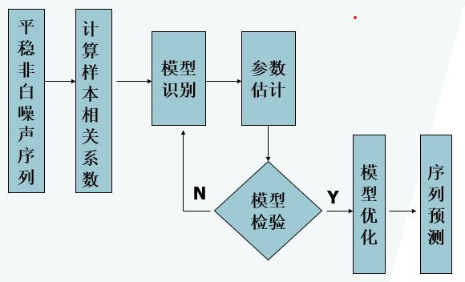

一个序列经过预处理（平稳性，纯随机性检验）被识别为平稳非白噪声序列，说明该序列中蕴含着相关信息，通过建立一个线性模型来拟合序列的发展，借此提取序列中的有用信息。

# 方法性工具
## 差分运算
### p阶差分
一阶差分：相距一期的两个序列值相减
\[\nabla {x_t} = {x_t} - {x_{t - 1}}\]

二阶差分：对一阶差分后序列再进行一阶差分
\[{\nabla ^2}{x_t} = {\nabla}{x_t} - {\nabla}{x_{t - 1}}\]

p阶差分：对P-1阶差分后的序列再进行一次一阶差分
\[{\nabla ^p}{x_t} = {\nabla ^{p - 1}}{x_t} - {\nabla ^{p - 1}}{x_{t - 1}}\]

### k步差分

相距k期的两个序列值之间的减法运算称为k步差分运算。记${\nabla _k}{x_t}$为$x_t$的k步差分：
\[{\nabla _k}{x_t} = {x_t} - {x_{t - k}}\]

## 延迟算子
### 定义
延迟算子类似于一个时间指针，当前序列值乘以一个延迟算子，就相当于把当前序列值的时间向过去拨了一个时刻。记B为延迟算子，有
\[\begin{array}{l}
{x_{t - 1}} = B{x_t}\\
{x_{t - 2}} = {B^2}{x_t}\\
                                             \vdots \\
{x_{t - p}} = {B^p}{x_t},\forall p \ge 1
\end{array}\]

延迟算子性质:

1. ${B^0} = 1$
2. $B(c \cdot {x_t}) = c \cdot B({x_t}) = c \cdot {x_{t - 1}},c为任意常数$
3. $B({x_t} \pm {y_t}) = {x_{t - 1}} \pm {y_{t - 1}}$
4. ${B^n}{x_t} = {x_{t - n}}$
5. ${(1 - B)^n} = \sum\limits_{i = 0}^n {{{( - 1)}^i}C_n^i} {B^i},其中C_n^i = \frac{{n!}}{{i!(n - i)!}}$

### 用延迟算子表示差分运算
* p阶差分
\[{\nabla ^p}{x_t} = {(1 - B)^p}{x_t} = \sum\limits_{i = 0}^p {{{( - 1)}^i}C_p^i} {x_{t - i}}\]
* k步差分
\[{\nabla _k} = {x_t} - {x_{t - k}} = (1 - {B^k}){x_t}\]

## 线性差分方程
### 线性差分方程定义
1. 非齐次线性差分方程
\[{z_t} + {a_1}{z_{t - 1}} + {a_2}{z_{t - 2}} +  \cdots  + {a_p}{z_{t - p}} = h(t)\]
式中，$p>=1;a_1,a_2,\cdots,a_p为实数，h(t)为t的已知函数$

2. 齐次线性差分方程
\[{z_t} + {a_1}{z_{t - 1}} + {a_2}{z_{t - 2}} +  \cdots  + {a_p}{z_{t - p}} = 0\]

### 齐次线性差分方程的解
特征方程：\[{\lambda^p} + {a_1}{\lambda^{p - 1}} + {a_2}{\lambda^{p - 2}} +  \cdots  + {a_p} = 0\]

这是一个一元p次线性方程，有p个非零根，成为特征方程的特征根，记作${\lambda_1},{\lambda_2}, \cdots ,{\lambda_p}$

**齐次线性差分方程的通解**：

1. 不相等实数根场合(${\lambda_1},{\lambda_2}, \cdots ,{\lambda_p}$均不相同)
\[{z_t} = {c_1}\lambda_1^t + {c_2}\lambda_2^t +  \cdots  + {c_p}\lambda_p^t\]
2. 有相等实根场合(${\lambda_1} = {\lambda_2} =  \cdots  = {\lambda_d},而\lambda_{d+1}, \lambda_{d+2}, \cdots, \lambda_{p}$为互不相同实根)
\[{z_t} = ({c_1} + {c_2}t +  \cdots  + {c_d}{t^{d - 1}})\lambda_1^t + {c_{d + 1}}\lambda_{d + 1}^t +  \cdots  + {c_p}\lambda_p^t\]
3. ${\lambda_1,\lambda_2, \cdots ,\lambda_p}$中有复根
\[{z_t} = {r^t}({c_1}{e^{it\omega }} + {c_2}{e^{ - it\omega }}) + {c_3}\lambda_3^t +  \cdots  + {c_p}\lambda_p^t\]

### 非齐次线性差分方程的解 
**非齐次线性差分方程的通解**：

1. 非齐次线性差分方程的特解$z''_t$:使得非齐次线性差分方程成立的任意一个解\[{z''_t} + {a_1}{z''_{t - 1}} + {a_2}{z''_{t - 2}} +  \cdots  + {a_p}{z''_{t - p}} = h(t)\]
2. 非齐次线性差分方程的通解:齐次线性差分方程的通解$z'_t$和非齐次线性差分方程的特解$z''_t$之和.
\[{z_t} = {z'_t} + {z''_t}\]

### 时序分析与线性差分方程的关系
常用的时间序列模型和某些模型的自协方差函数和自相关函数都可以视为线性差分方程.线性差分方程对应的特征根的性质对判断模型的平稳性有着非常重要的意义

# ARMA模型的性质
## AR模型
### 定义
具有如下结构的模型称为p阶自回归模型，简记为$AR(p)$(Auto Regression Model)
\[\left\{ \begin{array}{l}
{x_t} = {\phi _0} + {\phi _1}{x_{t - 1}} + {\phi _2}{x_{t - 2}} +  \cdots  + {\phi _p}{x_{t - p}} + {\varepsilon _t}\\
{\phi _p} \ne 0\\
E({\varepsilon _t}) = 0Var({\varepsilon _t}) = \sigma _\varepsilon ^2,E({\varepsilon _t}{\varepsilon _s}) = 0,s \ne t\\
E{x_s}{\varepsilon _t} = 0,\forall s < t
\end{array} \right.\]
AR(p)模型的三个限制条件：

1. ${\phi _p} \ne 0$,保证模型的最高阶数为p.
2. $E({\varepsilon _t}) = 0Var({\varepsilon _t}) = \sigma _\varepsilon ^2,E({\varepsilon _t}{\varepsilon _s}) = 0,s \ne t$,随机干扰序列$\{ \varepsilon _t\}$为零均值白噪声序列.
3. $E{x_s}{\varepsilon _t} = 0,\forall s < t$,当期的随机干扰项与过去序列值无关.
    
特别当${\phi _0} = 0$时，称为中心化$AR(p)$模型.

非中心化$AR(p)$序列可通过如下变换转化为中心化$AR(p)$序列：
令

$\mu  = \frac{{{\varphi _0}}}{{1 - {\varphi _1} -  \cdots  - {\varphi _p}}},{y_t} = {x_t} - \mu$

称$\{ {y_t}\}$为$\{{x_t}\}$的中心化序列.

引进延迟算子，中心$AR(p)$模型又可以简记为: \[\Phi (B){x_t} = {\varepsilon _t}\]
式中，$\Phi (B) = 1 - {\varphi _1}B - {\varphi _2}{B^2} -  \cdots  - {\varphi _p}{B^p}$称为**p阶自回归系数多项式**.

### AR模型平稳性判别
判别原因：AR模型是常用的平稳序列的拟合模型之一，但并非所有的AR模型都是平稳的 

1. arima.sim函数拟合

拟合平稳ar序列、MA序列、平稳ARMA序列和ARIMA序列
```
命令格式:arima.sim(n,list(ar=,ma=,order=),sd=)
n:拟合序列的长度
list:具体模型参数系数
   list(ar=c()):平稳AR(p)模型的自回归系数，非平稳AR模型会报错
   list(ma=c()):MA(q)模型的移动平均系数
   list(ar=c(),ma=c()):ARMA(p,q)模型的系数，非平稳ARMA模型会报错
   list(ar=,ma=,order=C(p,d,q)):ARIMA(p,d,q)模型，d为差分阶数
sd:指定序列标准差，默认为1
```
```{r echo=TRUE}
ts1 <- arima.sim(n=100, list(ar=c(-0.4,0.5)), sd=2)
plot(ts1, type = "l")
#从图中可以看出该AR(2)模型平稳
```

2. filter函数拟合

拟合AR序列（无论是否平稳）和MA序列
```
命令格式为filter(e,filter=,method=,circular=)
-e:随机波动序列的变量名
-filter:模型系数
        AR(p)模型：filter=c(系数)
        MA(q)模型：filter=c(系数)
-method:指定拟合模型
      method="recursive" 为AR模型
      method="convolution" 为MA模型
-circular:拟合MA模型专用选项，circular=T避免NA数据出现
```
```{r echo=TRUE}
e <- rnorm(100)
ts2 <- filter(e,filter = -1.1,method = "recursive")
plot(ts2, type = "l")
#从图中可以看出该AR(1)模型非平稳
```

#### 单位根判别法
1. 自回归方程的解

任一个中心化$AR(p)$模型$\Phi (B){x_t} = {\varepsilon _t}$     都可以视为一个非齐次线性差分方程$${x_t} = {\phi _0} + {\phi _1}{x_{t - 1}} + {\phi _2}{x_{t - 2}} +  \cdots  + {\phi _p}{x_{t - p}} + {\varepsilon _t}$$
它的通解求法如下

（1）求齐次线性差分方程$\Phi (B){x_t} =0$的一个通解$x'_t$ 
\[{x'_t} = \sum\limits_{j = 1}^d {{c_j}{t^{j - 1}}} \lambda_1^t + \sum\limits_{j = d + 1}^{p - 2m} {{c_j}\lambda_j^t}  + \sum\limits_{j = 1}^m {r_j^t({c_{1j}}\cos t{\omega _j} + {c_{2j}}\sin t{\omega _j})} \]

（2）求齐次线性差分方程$\Phi (B){x_t} = {\varepsilon _t}$的一个特解$x''_t$ 
\[{x''_t} = \frac{{{\varepsilon _t}}}{{\Phi (B)}} = \frac{{{\varepsilon _t}}}{{\prod\limits_{i = 1}^p {(1 - {\lambda_i}B)} }} = \sum\limits_{i = 1}^p {\frac{{{k_i}}}{{1 - {\lambda_i}B}}{\varepsilon _t}} \]
【注】：AR(p)模型的自回归系数多项式方程$\Phi (u)=0$的根是齐次线性方程$\Phi (B){x_t} =0$的特征根的倒数

（3）求非齐次线性差分方程$\Phi (B){x_t} = {\varepsilon _t}$的通解${x_t} = {x'_t} + {x''_t}$
\[{x_t} = \sum\limits_{j = 1}^d {{c_j}{t^{j - 1}}} \lambda_1^t + \sum\limits_{j = d + 1}^{p - 2m} {{c_j}{\lambda^t}}  + \sum\limits_{j = 1}^m {\gamma _j^t({c_{1j}}\cos t{w_j} + {c_{2j}}\sin t{\varpi _j})}  + \sum\limits_{i = 1}^p {\frac{{{k_i}}}{{1 - {\lambda_i}B}}{\varepsilon _t}} \]

2. 单位根检验

要使中心化$AR(p)$模型,即要求对$\forall {c_1}, \cdots ,{c_{p - 2m}},{c_{1j}},{c_{2j}}(j = 1, \cdots ,m)$
\[\mathop {\lim }\limits_{t \to \infty } {x_t} = \mathop {\lim }\limits_{t \to \infty } [\sum\limits_{j = 1}^d {{c_j}{t^{j - 1}}} \lambda_1^t + \sum\limits_{j = d + 1}^{p - 2m} {{c_j}{\lambda^t}}  + \sum\limits_{j = 1}^m {\gamma _j^t({c_{1j}}\cos t{w_j} + {c_{2j}}\sin t{\varpi _j})}  + \sum\limits_{i = 1}^p {\frac{{{k_i}}}{{1 - {\lambda_i}B}}{\varepsilon _t}} ] = 0\]
上式成立的充要条件：
\[\begin{array}{l}
\left| {{\lambda_j}} \right| < 1{\rm{     }},j = 1,2, \cdots ,p - 2m\\
\left| {{\gamma _j}} \right| < 1{\rm{     , }}j = 1,2, \cdots ,m
\end{array}\]
即$AR(p)$模型平稳的充要条件是它的p个特征根都在单位圆内。

根据特征根和自回归系数多项式的根成倒数，AR模型平稳的等价判别条件是AR模型的自回归系数多项式的根即$\Phi (B){x_t} =0$，都在单位圆外.

#### 平稳域判别法
对于一个$AR(p)$模型而言，如果没有平稳性的要求，实际上也就意味着对参数向量没有任何限制，它们可以取遍维欧氏空间的任意一点.如果加上了平稳性限制，参数向量就只能取维欧氏空间的一个子集，使得特征根都在单位圆内的系数集合$\{ {\phi _1},{\phi _2}, \cdots ,{\phi _p}\left|特征根都在单位圆内\right.$.对于低阶自回归模型用平稳域的方法判别模型的平稳性通常更为简便。 

（1）**AR(1)模型平稳条件**

* 方程结构
${x_t} = \phi {x_{t-1}} + {\varepsilon _t}$
* 特征根
$\lambda=\phi$
* 平稳域
$\left| \phi  \right| < 1$

（2）**AR(2)模型平稳条件**

* 方程结构
${x_t} = {\phi _1}{x_{t - 1}} + {\phi _2}{x_{t - 2}} + {\varepsilon _t}$
* 特征根
${\lambda_1} = \frac{{{\phi _1} + \sqrt {\phi _1^2 + 4{\phi _2}} }}{2}                                                                        {\lambda_2} = \frac{{{\phi _1} - \sqrt {\phi _1^2 + 4{\phi _2}} }}{2}$
* 平稳域

$\begin{array}{l}
1)\left| {{\phi _2}} \right| = \left| {{\lambda_1}{\lambda_2}} \right| < 1\\
2){\phi _2} + {\phi _1} =  - {\lambda_1}{\lambda_2} + {\lambda_1} + {\lambda_2} = 1 - (1 - {\lambda_1})(1 - {\lambda_2}) < 1\\
3){\phi _2} - {\phi _1} =  - {\lambda_1}{\lambda_2} - {\lambda_1} - {\lambda_2} = 1 - (1 + {\lambda_1})(1 + {\lambda_2}) < 1
\end{array}$
$\Rightarrow \{ {\phi _1},{\phi _2}\left| {\left| {{\phi _2}} \right| < 1{\phi _2} \pm {\phi _1} < 1\} } \right.$

### 平稳AR模型的统计性质
#### 均值

如果AR(p)模型满足平稳性条件，则有
\[E{x_t} = E({\varphi _0} + {\varphi _1}{x_{t - 1}} +  \cdots  + {\varphi _p}{x_{t - p}} + {\varepsilon _t})\]
根据平稳序列均值为常数，且$\{ \varepsilon _t\}$为白噪声序列，有
\[E{x_t} = \mu ,E({\varepsilon _t}) = 0                      ,\forall t \in T\]
推导出
\[\mu  = \frac{{{\varphi _0}}}{{1 - {\varphi _1} -  \cdots  - {\varphi _p}}}\]
特别地，对于中心化AR(p)模型，有$E{x_t} =0$

#### 方差

**AR模型的传递形式**
\[\begin{array}{c}
{x_t} = \frac{{{\varepsilon _t}}}{{\Phi (B)}} = \sum\limits_{i = 1}^p {\frac{{{k_i}}}{{1 - {\lambda_i}B}}{\varepsilon _t}}  = \sum\limits_{i = 1}^p {\sum\limits_{j = 0}^\infty  {{k_i}{{({\lambda_i}B)}^j}{\varepsilon _t}} } \\
 = \sum\limits_{j = 0}^\infty  {\sum\limits_{i = 1}^p {{k_i}\lambda_i^j{\varepsilon _{t - j}}} } \\
\underline{\underline  \wedge } \sum\limits_{j = 0}^\infty  {{G_j}} {\varepsilon _{t - j}}
\end{array}\]
式中，$G_0=1,G_j=\sum\limits_{i = 1}^p{k_i\lambda_i^j}(j=1,2,\cdots)$
,其中系数$\{ {G_j},j = 1,2, \cdots \}$称为Green函数

**Green函数递推公式**

原理：
\[\left\{ \begin{array}{l}
\Phi (B){x_t} = {\varepsilon _t}\\
{x_t} = G(B){\varepsilon _t}
\end{array} \right. \Rightarrow \Phi (B)G(B){\varepsilon _t} = {\varepsilon _t}\]

方法：待定系数法
\[\begin{array}{l}
(1 - \sum\limits_{k = 1}^p {{\phi _k}{B^k}} )(\sum\limits_{j = 0}^\infty  {{G_j}{B^j}} ){\varepsilon _t} = {\varepsilon _t}\\
 \Rightarrow [1 + \sum\limits_{j = 1}^\infty  {({G_j} - \sum\limits_{k = 1}^j {{{\phi '}_k}{G_{j - k}})} {B^j}} ]{\varepsilon _t} = {\varepsilon _t}\\
 \Rightarrow {G_j} - \sum\limits_{k = 1}^j {{{\phi '}_k}} {G_{j - k}} = 0\\
 \Rightarrow \left\{ \begin{array}{l}
{G_0} = 1\\
{G_j} = \sum\limits_{k = 1}^j {{{\phi '}_k}} {G_{j - k}}j = 1,2, \cdots 
\end{array} \right.其中{{\phi '}_k} = \left\{ \begin{array}{l}
{\phi _k},k \le p\\
0,k > p
\end{array} \right.
\end{array}\]

**平稳AR模型的方差**

对平稳AR模型${x_t} = \sum\limits_{j = 0}^\infty  {{G_j}} {\varepsilon _{t - j}}$两边求方差
\[Var({x_t}) = \sum\limits_{j = 0}^\infty  {G_j^2} \sigma _\varepsilon ^2        ,        {G_j}为Green函数\]

因为$G_j$呈指数下降，所以$\sum\limits_{j = 0}^\infty  {G_j^2}<\infty$,这说明平稳序列${x_t}$方差有界，等于常数$\sum\limits_{j = 0}^\infty  {G_j^2} \sigma _\varepsilon ^2$

平稳AR(1)模型的方差

**协方差函数**

在平稳AR(p)模型两边同乘${x_{t - k}},\forall k \ge 1$，再求期望
\[E({x_t}{x_{t - k}}) = {\varphi _1}E({x_{t - 1}}{x_{t - k}}) +  \cdots  + {\varphi _p}E({x_{t - p}}{x_{t - k}}) + E({\varepsilon _t}{x_{t - k}})\]

根据\[E({\varepsilon _t}{x_{t - k}}) = 0\]

得协方差函数的递推公式
\[{\gamma _k} = {\varphi _1}{\gamma _{k - 1}} + {\varphi _2}{\gamma _{k - 2}} +  \cdots  + {\varphi _p}{\gamma _{k - p}},\forall k \ge 1\]

平稳AR(1)模型的协方差
\[{\gamma _k} = \phi _1^k\frac{{  \sigma _\varepsilon ^2}}{{1 - \phi _1^2}}              ,\forall k \ge 1\]
平稳AR(2)模型的协方差
\[\left\{ \begin{array}{l}
{\gamma _0} = \frac{{1 - {\phi _2}}}{{(1 + {\phi _2})(1 - {\phi _1} - {\phi _2})(1 + {\phi _1} - {\phi _2})}}\sigma _\varepsilon ^2\\
{\gamma _1} = \frac{{{\phi _1}{\gamma _0}}}{{1 - {\phi _2}}}\\
{\gamma _k} = {\phi _1}{\gamma _{k - 1}} + {\phi _2}{\gamma _{k - 2}}，k \ge 2
\end{array} \right.\]

#### 自相关系数
1. 平稳AR模型自相关系数递推公式

自相关系数的定义\[{\rho _k} = \frac{{{\gamma _k}}}{{{\gamma _0}}}    \]

平稳AR(P)模型的自相关系数递推公式
\[{\rho _k} = {\phi _1}{\rho _{k - 1}} + {\phi _2}{\rho _{k - 2}} +  \cdots  + {\phi _p}{\rho _{k - p}}\]

平稳AR(1)模型的自相关系数递推公式
\[{\rho _k} = \phi _1^k,k \ge 0\]
平稳AR(2)模型的自相关系数递推公式
\[{\rho _k} = \left\{ \begin{array}{l}
1            ,k = 0\\
\frac{{{\phi _1}}}{{1 - {\phi _2}}}            ,k = 1\\
{\phi _1}{\rho _{k - 1}} + {\phi _2}{\rho _{k - 2}}                   ,k \ge 2
\end{array} \right.\]
2. 自相关系数的性质

（1） 拖尾性
AR模型自相关系数的表达式是一个齐次差分方程，设它的通解形式为
$${\rho _k} = \sum\limits_{i = 1}^p {{c_i}\lambda_i^k}，\left| {{\lambda_i}} \right| < 1,且{c_1}, \cdots ,{c_p}不能全为零$$
通过这个通解形式，容易推出${\rho _k}$始终有非零取值，不会在k大于某个常数之后就恒等于零，这个性质就是拖尾性。

（2） 呈指数衰减
随着时间的推移，${\rho _k}$会迅速衰减，因为$\left| {{\lambda_i}} \right| < 1$，所以$k \to \infty $时，$\lambda_{i}^{k} \rightarrow 0(i=1,2, \cdots, p)$，继而导致${\rho _k} = \sum\limits_{i = 1}^p {{c_i}\lambda_i^k}  \to 0$,而这种影响是以指数$\lambda^{k}$的速度在衰减。
$$\left| {{\lambda_i}} \right| < 1                                         \Rightarrow                                         {\rho _k} = \sum\limits_{i = 1}^p {{c_i}\lambda_i^k}  \to 0$$

自相关系数呈指数衰减表现在自相关图中判断平稳序列的“短期相关性”，这是平稳序列的重要特征。这个特征表明对于平稳序列而言，通常只有近期的序列值对现值影响明显，间隔越远的过去值对现值的影响越小。


#### 偏自相关系数

1. 定义

对于平稳$AR(p)$序列，所谓滞后k偏自相关系数就是指在给定中间k-1个随机变量${x_{t - 1}},{x_{t - 2}}, \cdots ,{x_{t - k + 1}}$的条件下，或者说，在剔除了中间k-1个随机变量的干扰之后，${x_{t - k}}$对$x_t$影响的相关度量。用数学语言描述就是
\[{\rho _{{x_t},{x_{t - k}}\left| {{x_{t - 1}}, \cdots ,{x_{t - k + 1}}} \right.}} = \frac{{E[({x_t} - \hat E{x_t})({x_{t - k}} - \hat E{x_{t - k}})]}}{{E[{{({x_{t - k}} - \hat E{x_{t - k}})}^2}}}\]
式中，$\hat E{x_t} = E[{x_t}\left| {{x_{t - 1}}, \cdots ,{x_{t - k + 1}}} \right.]        ,        \hat E{x_{t - k}} = E[{x_{t - k}}\left| {{x_{t - 1}}, \cdots ,{x_{t - k + 1}}} \right.]$

2. 偏自相关系数的计算

假定${x_t}$是中心化平稳序列，用过去的k期序列值${{x_{t - 1}}, \cdots ,{x_{t - k}}}$作k阶自回归拟合，即
\[\begin{array}{l}
        {x_t} = {\phi _{k1}}{x_{t - 1}} + {\phi _{k2}}{x_{t - 2}} +  \cdots {\phi _{k(k - 1)}}{x_{t - k + 1}} + {\phi _{kk}}{x_{t - k}}\\
\hat E{x_t} = {\phi _{k1}}{x_{t - 1}} + {\phi _{k2}}{x_{t - 2}} +  \cdots {\phi _{k(k - 1)}}{x_{t - k + 1}} + {\phi _{kk}}\hat E({x_{t - k}}) + E{\varepsilon _t}\left| {{x_{t - 1}}, \cdots ,{x_{t - k + 1}}} \right.)\\
                                       = {\phi _{k1}}{x_{t - 1}} + {\phi _{k2}}{x_{t - 2}} +  \cdots {\phi _{k(k - 1)}}{x_{t - k + 1}} + {\phi _{kk}}\hat E({x_{t - k}})\\
则{x_t}-\hat E{x_t}={\phi _{kk}}({x_{t - k}}-\hat E({x_{t - k}})+\varepsilon _t\\
两边同时乘以x_{t - k}-\hat E({x_{t - k}}),并求期望：\\
E[({x_t} - \hat E{x_t})({x_{t - k}} - \hat E{x_{t - k}})] = {\phi _{kk}}E[{({x_{t - k}} - \hat E{x_{t - k}})^2}]\\
 \Rightarrow {\rho _{{x_t},{x_{t - k}}\left| {{x_{t - 1}}, \cdots ,{x_{t - k + 1}}} \right.}} = \frac{{E[({x_t} - \hat E{x_t})({x_{t - k}} - \hat E{x_{k - t}})]}}{{E[{{({x_{t - k}} - \hat E{x_{t - k}})}^2}]}} = {\phi _{kk}}
\end{array}\]

上式说明滞后k偏自相关系数实际上就等于k阶自回归模型第k个回归系数${\phi _{kk}}$的值。

3. Yule-Walker方程组

在${x_t} = {\phi _{k1}}{x_{t - 1}} + {\phi _{k2}}{x_{t - 2}} +  \cdots {\phi _{k(k - 1)}}{x_{t - k + 1}} + {\phi _{kk}}{x_{t - k}}$方程等号两边同时乘以$x_{t-l}$，并取期望，得
\[{\rho _l} = {\phi _{k1}}{\rho _{l - 1}} + {\phi _{k2}}{\rho _{l - 2}} +  \cdots  + {\phi _{kk}}{\rho _{l - k}}            ,\forall l > 0\]

取前k个方程构成的方程组即Yule-Walker方程组
\[\left\{ {\begin{array}{*{20}{c}}
{{\rho _1} = {\phi _{k1}}{\rho _0} + {\phi _{k2}}{\rho _1} +  \cdots  + {\phi _{kk}}{\rho _{k - 1}}}\\
{{\rho _2} = {\phi _{k1}}{\rho _1} + {\phi _{k2}}{\rho _0} +  \cdots  + {\phi _{kk}}{\rho _{k - 2}}}\\
{ \cdots  \cdots  \cdots  \cdots  \cdots  \cdots  \cdots  \cdots }\\
{{\rho _k} = {\phi _{k1}}{\rho _{k - 1}} + {\phi _{k2}}{\rho _{k - 2}} +  \cdots  + {\phi _{kk}}{\rho _0}}
\end{array}} \right.\]

解Yule-Walker方程组可以得到参数$({\phi _{k1}},{\phi _{k2}}, \cdots ,{\phi _{kk}})'$           的解，最后一个参数的解即为延迟K偏自相关系数

用矩阵形式表示

\[\left( {\begin{array}{*{20}{c}}
1&{{\rho _1}}& \cdots &{{\rho _{k - 1}}}\\
{{\rho _1}}&1& \cdots &{{\rho _{k - 2}}}\\
 \vdots & \vdots & \cdots & \vdots \\
{{\rho _{k - 1}}}&{{\rho _{k - 2}}}& \cdots &1
\end{array}} \right)\left( {\begin{array}{*{20}{c}}
{{\phi _1}}\\
{{\phi _2}}\\
 \vdots \\
{{\phi _p}}
\end{array}} \right) = \left( {\begin{array}{*{20}{c}}
{{\rho _1}}\\
{{\rho _2}}\\
 \vdots \\
{{\rho _k}}
\end{array}} \right)\]
根据Cramer法则 $$          {\phi _{kk}} = \frac{{{D_k}}}{D}$$ 
其中$$D = \left| {\begin{array}{*{20}{c}}
1&{{\rho _1}}& \cdots &{{\rho _{k - 1}}}\\
{{\rho _1}}&1& \cdots &{{\rho _{k - 2}}}\\
 \vdots & \vdots & \vdots & \vdots \\
{{\rho _{k - 1}}}&{{\rho _{k - 2}}}& \cdots &1
\end{array}} \right|                            ,                          {D_k} = \left| {\begin{array}{*{20}{c}}
1&{{\rho _1}}& \cdots &{{\rho _1}}\\
{{\rho _1}}&1& \cdots &{{\rho _2}}\\
 \vdots & \vdots & \vdots & \vdots \\
{{\rho _{k - 1}}}&{{\rho _{k - 2}}}& \cdots &{{\rho _k}}
\end{array}} \right|$$

4. AR模型偏自相关系数的截尾性

平稳AR(p)模型的偏自相关系数具有p步截尾性，所谓p步截尾指${\phi _{kk}}=
0(\forall k > p)$

AR(1)模型偏自相关系数的计算
$\phi_{k k}=\left\{\begin{array}{ll}{\phi_{1},} & {k=1} \\ {0,} & {k \geqslant 2}\end{array}\right.$
AR(2)模型偏自相关系数的计算
$\phi_{k k}=\left\{\begin{array}{ll}{\frac{\phi_{1}}{1-\phi_{2}},} & {k=1} \\ {\phi_{2},} & {k=2} \\ {0,} & {k \geqslant 3}\end{array}\right.$

## MA模型

### 定义

  具有如下结构的模型称为q阶移动平均模型，简记为MA(q)

  $$\left\{ \begin{array}{l}
  {x_t} = \mu  + {\varepsilon _t} - {\theta _1}{\varepsilon _{t - 1}} - {\theta _2}{\varepsilon _{t - 2}} -  \cdots  - {\theta _q}{\varepsilon _{t - q}}\\
  {\theta _q} \ne 0\\
  E({\varepsilon _t}) = 0,Var({\varepsilon _t}) = \sigma _\varepsilon ^2,E({\varepsilon _t}{\varepsilon _s}) = 0,s \ne t
  \end{array} \right.$$
  
  当前随机冲击${\varepsilon _t}$加上前面q期随机冲击之和


```{r eval=T}
n <- 100
et <- rnorm(n)
et <- c(0,0,et)

theta <- c(0.2, 0.5)
xt <- c()

for(i in 1:100) {
xt[i] <- et[i+2]-theta[1]*et[i+1] - theta[2]*et[i]
}

plot(xt, type = "l")


acf(xt)
pacf(xt)

arima(xt, order = c(0, 0, 2),include.mean = F)
```

  特别当$\mu  = 0$时，称为中心化MA(q)模型

  引进延迟算子，中心化MA(q)模型又可以简记为

  $${x_t} = \Theta (B){\varepsilon _t}$$

  q阶移动平均系数多项式为

  $$\Theta (B) = 1 - {\theta _1}B - {\theta _2}{B^2} -  \cdots  - {\theta _q}{B^q}$$

### MA模型的统计性质

- 常数均值

  $$\begin{array}{c}
  E{x_t} = E\mu  + {\varepsilon _t} - {\theta _1}{\varepsilon _{t - 1}} - {\theta _2}{\varepsilon _{t - 2}} -  \cdots  - {\theta _q}{\varepsilon _{t - q}}= \mu 
  \end{array}$$

- 常数方差

  $$\begin{array}{c}
  Var({x_t}) = Var(\mu  + {\varepsilon _t} - {\theta _1}{\varepsilon _{t - 1}} - {\theta _2}{\varepsilon _{t - 2}} -  \cdots  - {\theta _q}{\varepsilon _{t - q}})\\
   = (1 + \theta _1^2 +  \cdots  + \theta _q^2)\sigma _\varepsilon ^2
  \end{array}$$

- 自协方差函数q阶截尾
  
  $${\gamma _k} = \left\{ \begin{array}{l}
  (1 + \theta _1^2 +  \cdots  + \theta _q^2)\sigma _\varepsilon ^2,{\rm{  }}k = 0\\
  ( - {\theta _k} + \sum\limits_{i = 1}^{q - k} {{\theta _i}{\theta _{k + i}}} )\sigma _\varepsilon ^2,{\rm{  }}1 \le k \le q\\
  0,{\rm{                              }} k > q
\end{array} \right.$$
  
- 自相关系数q阶截尾

  $${\rho _k} = \left\{ \begin{array}{l}
  1,{\rm{                          }}k = 0\\
  \frac{{ - {\theta _k} + \sum\limits_{i = 1}^{q - k} {{\theta _i}{\theta _{k + i}}} }}{{1 + \theta _1^2 +  \cdots  + \theta _q^2}},{\rm{  }}1 \le k \le q\\
  0,{\rm{                         }}k > q
  \end{array} \right.$$

### 常用MA模型的自相关系数

- MA(1)模型

  $${\rho _k} = \left\{ \begin{array}{l}
  1{\rm{             ,}}k = 0\\
  \frac{{ - {\theta _1}}}{{1 + \theta _1^2}}{\rm{   }}        {\rm{,}}k = 1\\
  0{\rm{         }}            {\rm{ ,}}k \ge 2
  \end{array} \right.$$

- MA(2)模型

  $${\rho _k} = \left\{ \begin{array}{l}
  1{\rm{                        ,}}k = 0\\
  \frac{{ - {\theta _1} + {\theta _1}{\theta _2}}}{{1 + \theta _1^2 + \theta _2^2}}{\rm{       ,}}k = 1\\
  \frac{{ - {\theta _2}}}{{1 + \theta _1^2 + \theta _2^2}}{\rm{       ,}}k = 2\\
  0{\rm{                       ,}}k \ge 3
  \end{array} \right.$$

### MA模型的可逆性

  一个自相关系数未必唯一对应一个平稳时间序列模型，当两个AR或MA模型对应系数分别互为倒数时，他们的自相关系数正好相等。如果自相关系数和模型之间不是一一对应关系，就将导致拟合模型和随机序列之间不会是一一对应关系，这会给我们将来的工作增加麻烦。

  为了保证一个给定的自相关函数能够对应唯一的模型，我们就要给模型增加约束条件。这个约束条件称为模型的可逆性条件。

- 可逆MA模型定义

  若一个MA模型能够表示称为收敛的AR模型形式，那么该MA模型称为可逆MA模型。一个自相关系数列唯一对应一个可逆MA模型。

- MA(q)模型的可逆条件是：

  MA(q)模型的特征根都在单位圆内

  即$\left| {{\lambda_i}} \right| < 1$

  等价条件是移动平滑系数多项式的根都在单位圆外

  即$\left| {\frac{1}{{{\lambda_i}}}} \right| > 1$

  MA(1)可逆条件：$- 1 < {\theta _1} < 1$

  MA(2)可逆条件：$\left| {{\theta _2}} \right| < 1,且{\theta _2} \pm {\theta _{\rm{1}}} < 1$

- 逆函数递推公式

  原理：

  $$\left\{ \begin{array}{l}
  {x_t} = \Theta (B){\varepsilon _t}\\
  {\varepsilon _t} = I(B){x_t}
  \end{array} \right. \Rightarrow \Theta (B)I(B){x_t} = {x_t}$$

  方法：待定系数法

  递推公式：

  $$\left\{ \begin{array}{l}
  {I_0} = 1\\
  {I_j} = \sum\limits_{k = 1}^j {{{\theta '}_k}} {I_{j - k}},j = 1,2, \cdots 
  \end{array} \right.,{\theta '_k} = \left\{ \begin{array}{l}
  {\theta _k},k \le q\\
  0,k > q
  \end{array} \right.$$

### MA模型偏自相关系数拖尾

对于一个可逆MA(q)模型，可以等价写成$AR(\infty )$模型形式$I(B){x_t}   = {\varepsilon _t}$

 其中$\left\{ \begin{array}{l}{I_0} = 1\\
{I_j} = \sum\limits_{k = 1}^l {{{\theta '}_k}{I_{j - k}}}                     ,j \ge 1
\end{array} \right.$

 AR(p)模型偏自相关系数p阶截尾，所以可逆MA(q)模型偏自相关系数$\infty$阶截尾，即具有偏自相关系数拖尾属性。

  一个可逆MA(q)模型一定对应着一个与它具有相同自相关系数和偏自相关系数的不可逆MA(q)模型，这个不可逆MA(q)模型也同样具有偏自相关系数拖尾特性。

## ARMA模型

### 定义

具有如下结构的模型称为自回归移动平均模型，简记为$ARMA(p,q)$

$$\left\{ \begin{array}{l}
{x_t} = {\phi _0} + {\phi _1}{x_{t - 1}} +  \cdots  + {\phi _p}{x_{t - p}} + {\varepsilon _t} - {\theta _1}{\varepsilon _{t - 1}} -  \cdots  - {\theta _q}{\varepsilon _{t - q}}\\
{\phi _p} \ne 0,{\theta _q} \ne 0\\
E({\varepsilon _t}) = 0,Var({\varepsilon _t}) = \sigma _\varepsilon ^2,E({\varepsilon _t}{\varepsilon _s}) = 0,s \ne t\\
E({x_s}{\varepsilon _t}) = 0,\forall s < t
\end{array} \right.$$

特别当${\varphi _0} = 0$v时，称为中心化$ARMA(p,q)$模型

引进延迟算子，中心化$ARMA(p,q)$模型又可以简记为：$\Phi (B){x_t} = \Theta (B){\varepsilon _t}$

p阶自回归系数多项式：$\Phi (B) = 1 - {\varphi _1}B - {\varphi _2}{B^2} -  \cdots  - {\varphi _p}{B^p}$

q阶移动平均系数多项式：$\Theta (B) = 1 - {\theta _1}B - {\theta _2}{B^2} -  \cdots  - {\theta _q}{B^q}$

### 平稳条件与可逆条件

- ARMA(p,q)模型的平稳条件

  P阶自回归系数多项式$\Phi (B) = 0$的根都在单位圆外

  即$ARMA(p,q)$模型的平稳性完全由其自回归部分的平稳性决定

- $ARMA(p,q)$模型的可逆条件

  q阶移动平均系数多项式$\Theta (B) = 0$的根都在单位圆外

  即$ARMA(p,q)$模型的可逆性完全由其移动平滑部分的可逆性决定

### 传递形式与逆转形式

- 传递形式

  $$\begin{array}{c}
  {x_t} = {\Phi ^{ - 1}}(B)\Theta (B){\varepsilon _t}= \sum\limits_{j = 0}^\infty  {{G_j}{\varepsilon _{t - j}}} 
  \end{array}$$

  $$\begin{array}{l}
  \left\{ \begin{array}{l}
  {G_0} = 1\\
  {G_k} = \sum\limits_{j = 1}^k {{{\phi '}_j}{G_{k - j}} - {{\theta '}_k}}                       ,                            k \ge 1
  \end{array} \right.\\
  其中：{{\phi '}_j} = \left\{ \begin{array}{l}
  {\phi _j}{\rm{   }},        1 \le j \le q\\
  0{\rm{     ,}}    j > q
  \end{array} \right.
  \end{array}$$

- 逆转形式

  $$\begin{array}{c}
  {\varepsilon _t} = {\Theta ^{ - 1}}(B)\Phi (B){x_t}= \sum\limits_{j = 0}^\infty  {{I_j}{x_{t - j}}} 
  \end{array}$$

  $$\begin{array}{l}
  \left\{ \begin{array}{l}
  {I_0} = 1\\
  {I_k} = \sum\limits_{j = 1}^k {{{\theta '}_j}{I_{k - j}} - {{\phi '}_k}}                       ,                            k \ge 1
  \end{array} \right.\\
  其中：{{\theta '}_j} = \left\{ \begin{array}{l}
  {\theta _j}{\rm{   }},        1 \le j \le q\\
  0{\rm{     ,}}    j > q
  \end{array} \right.
  \end{array}$$

### ARMA(p,q)模型的统计性质

- 均值

  $$E{x_t} = \frac{{{\varphi _0}}}{{1 - {\varphi _1} -  \cdots  - {\varphi _p}}}$$

- 协方差

  $$\gamma (k) = \sigma _\varepsilon ^2\sum\limits_{i = 0}^\infty  {{G_i}{G_{i + k}}} $$

- 自相关系数

  $$\rho (k) = \frac{{\gamma (k)}}{{\gamma (0)}} = \frac{{\sum\limits_{j = 0}^\infty  {{G_j}{G_{j + k}}} }}{{\sum\limits_{j = 0}^\infty  {G_j^2} }}$$

### $ARMA(p,q)$模型的相关性

- 自相关系数拖尾

- 偏自相关系数拖尾

- 相关性特征

  |   模型    | 自相关系数 | 偏自相关系数 |
  | :-------: | :--------: | :----------: |
  |   AR(P)   |    拖尾    |   P阶截尾    |
  |   MA(q)   |  q阶截尾   |     拖尾     |
  | ARMA(p,q) |    拖尾    |     拖尾     |


# 平稳序列建模

## 建模步骤




样本自相关系数

$${\hat \rho _k} = \frac{{\sum\limits_{t = 1}^{n - k} {({x_t} - \bar x)({x_{t + k}} - \bar x)} }}{{\sum\limits_{t = 1}^n {{{({x_t} - \bar x)}^2}} }}$$

样本偏自相关系数

$${\hat \varphi _{kk}} = \frac{{{{\hat D}_k}}}{{\hat D}}$$

## 模型识别

- 基本原则

| ${\hat\rho _k}$ | ${\hat \varphi _{kk}}$ | 选择模型  |
| :---------: | :--------------------: | :-------: |
|    拖尾     |        P阶截尾         |   AR(P)   |
|   q阶截尾   |          拖尾          |   MA(q)   |
|    拖尾     |          拖尾          | ARMA(p,q) |

- 定阶存在的困难：

由于样本的随机性，样本的相关系数不会呈现出理论截尾的完美情况，本应截尾的${\hat \rho _k}$或${\hat \varphi _{kk}}$仍会呈现出小值振荡的情况。

由于平稳时间序列通常都具有短期相关性，随着延迟阶数$k \to \infty $，${\hat \rho _k}$与${\hat \varphi _{kk}}$都会衰减至零值附近作小值波动。

- 样本相关系数的近似分布

  Barlett

  $${\hat \rho _k}\sim N(0,\frac{1}{n})            ,n \to \infty $$

  Quenouille

  $${\hat \varphi _{kk}}\sim N(0,\frac{1}{n})            ,n \to \infty $$

- 95％的置信区间

  $$\begin{array}{l}
  \Pr \left( { - \frac{2}{{\sqrt n }} \le {{\hat \rho }_k} \le \frac{2}{{\sqrt n }}} \right) \ge 0.95\\
  \Pr \left( { - \frac{2}{{\sqrt n }} \le {{\hat \phi }_{kk}} \le \frac{2}{{\sqrt n }}} \right) \ge 0.95
  \end{array}$$

- 模型定阶的经验方法

  如果样本(偏)自相关系数在最初的d阶明显大于两倍标准差范围，而后几乎95％的自相关系数都落在2倍标准差的范围以内，而且通常由非零自相关系数衰减为小值波动的过程非常突然。这时，通常视为(偏)自相关系数截尾。截尾阶数为d。
  
- R函数定阶

下载zoo和forecast包，运用auto.arima函数，该函数基于信息量最小原则自动识别模型阶数，并给出模型的参数估计值。
```
auto.arima(x,max.p=5,max.q=,ic=)
-x:定阶序列名
-max.p:自相关系数最高阶数，默认值为5
-max.q:移动平均系数最高阶数，默认值为5
-ic:指定信息量准则"aicc"、"aic"、"bic"，默认AIC准则
```  

## 参数估计

待估参数
$p + q + 2$个未知参数
$${\phi _1}, \cdots ,{\phi _p},{\theta _1}, \cdots ,{\theta _q},\mu ,\sigma _\varepsilon ^2$$

### 矩估计
1. 原理
  - 样本自相关系数估计总体自相关系数

$$\left\{ \begin{array}{l}
{\rho _1}({\phi _1}, \cdots ,{\phi _p},{\theta _1}, \cdots ,{\theta _q}) = {{\hat \rho }_1}\\
                                                                                                                     \vdots \\
{\rho _{p + q}}({\phi _1}, \cdots ,{\phi _p},{\theta _1}, \cdots ,{\theta _q}) = {{\hat \rho }_{p + q}}
\end{array} \right.$$

  - 样本一阶均值估计总体均值，样本方差估计总体方差

$$\hat \mu  = \bar x = \frac{{\sum\limits_{i = 1}^n {{x_i}} }}{n}$$
$$\hat \sigma _\varepsilon ^2 = \frac{{1 + \hat \varphi _1^2 +  \cdots  + \hat \varphi _p^2}}{{1 + \hat \theta _1^2 +  \cdots  + \hat \theta _q^2}}\hat \sigma _x^2$$

2. 例子
- 求AR(2)模型系数的矩估计

Yule-Walker方程

$${x_t} = {\varphi _1}{x_{t - 1}} + {\varphi _2}{x_{t - 2}} + {\varepsilon _t}$$

矩估计（Yule-Walker方程的解）

$$\left\{ \begin{array}{l}
{\rho _1} = {\varphi _1} + {\varphi _2}{\rho _1}\\
{\rho _2} = {\varphi _1}{\rho _1} + {\varphi _2}
\end{array} \right.$$
$${\hat \varphi _1} = \frac{{1 - {{\hat \rho }_2}}}{{1 - \hat \rho _1^2}}{\hat \rho _1}$$
$${\hat \varphi _2} = \frac{{{{\hat \rho }_2} - \hat \rho _1^2}}{{1 - \hat \rho _1^2}}$$

- 求MA(1)模型系数的矩估计

方程

$${x_t} = {\varepsilon _t} - {\theta _1}{\varepsilon _{t - 1}}$$

矩估计

$$\left\{ \begin{array}{l}
{\gamma _0} = (1 + \theta _1^2)\sigma _\varepsilon ^2\\
{\gamma _1} =  - {\theta _1}\sigma _\varepsilon ^2
\end{array} \right. \Rightarrow {\rho _1} = \frac{{{\gamma _1}}}{{{\gamma _0}}} = \frac{{ - {\theta _1}}}{{1 + \theta _1^2}}$$
$${\hat \theta _1} = \frac{{ - 1 + \sqrt {1 - 4\hat \rho _1^2} }}{{2{{\hat \rho }_1}}}$$

- 求ARMA(1,1)模型系数的矩估计

方程

$${x_t} = {\varphi _1}{x_{t - 1}} + {\varepsilon _t} - {\theta _1}{\varepsilon _{t - 1}}$$

矩估计

$$\left\{ \begin{array}{l}
{\gamma _0} = (1 + \theta _1^2)\sigma _\varepsilon ^2\\
{\gamma _1} =  - {\theta _1}\sigma _\varepsilon ^2
\end{array} \right. \Rightarrow {\rho _1} = \frac{{{\gamma _1}}}{{{\gamma _0}}}
  = \frac{{ - {\theta _1}}}{{1 + \theta _1^2}}$$
  
$${\hat \theta _1} = \frac{{ - 1 + \sqrt {1 - 4\hat \rho _1^2} }}{{2{{\hat \rho }_1}}}$$

3. 对矩估计的评价

- 优点

估计思想简单直观

不需要假设总体分布

计算量小（低阶模型场合）

- 缺点

信息浪费严重,只用到了p+q个样本自相关系数信息，其他信息都被忽略

估计精度差

- 通常矩估计方法被用作极大似然估计和最小二乘估计迭代计算的初始值 


### 极大似然估计

- 原理

在极大似然准则下，认为样本来自使该样本出现概率最大的总体。因此未知参数的极大似然估计就是使得似然函数（即联合密度函数）达到最大的参数值 

$$L({\hat \beta _1},{\hat \beta _2}, \cdots ,{\hat \beta _k};{x_1},\tilde x) = \max \{ p(\tilde x);{\beta _1},{\beta _2}, \cdots ,{\beta _k}\}$$ $$\left\{ \begin{array}{l}
\frac{\partial }{{\partial \sigma _\varepsilon ^2}}l(\tilde \beta ;\tilde x) = \frac{n}{{2\sigma _\varepsilon ^2}} - \frac{{S(\tilde \beta )}}{{2\sigma _\varepsilon ^4}} = 0\\
\frac{\partial }{{\partial \tilde \beta }}l(\tilde \beta ;\tilde x) = \frac{1}{2}\frac{{\partial \ln \left| \Omega  \right|}}{{\partial \tilde \beta }} + \frac{1}{{2\sigma _\varepsilon ^2}}\frac{{\partial S(\tilde \beta )}}{{\partial \tilde \beta }} = 0
\end{array} \right.$$
由于$S(\tilde \beta )$和$\ln \left| \Omega  \right|$都不是$\tilde \beta $  的显式表达式。因而似然方程组实际上是由p+q+1个超越方程构成，通常需要经过复杂的迭代算法才能求出未知参数的极大似然估计值 

- 优点

1.极大似然估计充分应用了每一个观察值所提供的信息，因而它的估计精度高

2.同时还具有估计的一致性、渐近正态性和渐近有效性等许多优良的统计性质

- 缺点

需要假定总体分布


### 最小二乘估计
1. 原理

使残差平方和达到最小的那组参数值即为最小二乘估计值 

$$\begin{array}{c}
Q(\hat \beta ) = \min Q(\tilde \beta )  \\
 = \min {\sum\limits_{t = 1}^n {({x_t} - {\varphi _1}{x_{t - 1}} -  \cdots  - {\varphi _p}{x_{t - p}} - {\theta _1}{\varepsilon _{t - 1}} -  \cdots  - {\theta _q}{\varepsilon _{t - q}})} ^2}
\end{array}$$

2. 条件最小二乘估计

**实际中最常用的参数估计方法**

- 假设条件

$${x_t} = 0        ,        t \le 0$$

- 残差平方和方程

$$Q(\tilde \beta ) = \sum\limits_{i = 1}^n {\varepsilon _t^2}    = \sum\limits_{i = 1}^n {{{[{x_t} - \sum\limits_{i = 1}^t {{\pi _i}{x_{t - 1}}} ]}^2}} $$

- 解法

迭代法


- 优点

1.最小二乘估计充分应用了每一个观察值所提供的信息，因而它的估计精度高

2.条件最小二乘估计方法使用率最高

- 缺点

需要假定总体分布

### 用R进行参数估计

参数估计通过调用arima()函数完成
```
arima(x,order=,include.mean=,method=)
-x:进行模型拟合的序列名
-order:指定模型阶数.order=c(p,d,q)
-include.mean:要不要包含常数项
include.mean=T 需要拟合常数项(默认)
-method:指定参数估计方法
method="CSS-ML",默认条件最小二乘与极大似然估计混合方法
method="ML"，极大似然估计
method="CSS",条件最小二乘估计
```

## 模型检验
- 目的

检验模型的有效性（对信息的提取是否充分）

- 检验对象

残差序列

- 判定原则

1.一个好的拟合模型应该能够提取观察值序列中几乎所有的样本相关信息，即残差序列应该为白噪声序列 

2.反之，如果残差序列为非白噪声序列，那就意味着残差序列中还残留着相关信息未被提取，这就说明拟合模型不够有效

- 假设条件

原假设：残差序列为白噪声序列

$${H_0}:{\rho _1} = {\rho _2} =  \cdots  = {\rho _m} = 0,\forall m \ge 1$$

- 备择假设：残差序列为非白噪声序列

$${H_1}:至少存在某个{\rho _k} \ne 0,\forall m \ge 1k \le m$$

- 检验统计量

$$LB = n(n + 2)\sum\limits_{k = 1}^m {(\frac{{\hat \rho _k^2}}{{n - k}})} \sim {\chi ^2}(m)$$
若拒绝原假设，说明残差序列中还残留相关信息，拟合模型不显著；如果不拒绝原假设，认为拟合模型显著有效。

### 模型的显著性检验

整个模型对信息的提取是否充分

### 参数的显著性检验

- 目的

检验每一个未知参数是否显著非零。删除不显著参数使模型结构最精简 

- 假设条件

$${H_0}:{\beta _j} = 0                                   \leftrightarrow                                   {H_1}:{\beta _j} \ne 0                                                          \forall 1 \le j \le m$$

- 检验统计量

$$T = \sqrt {n - m} \frac{{{{\hat \beta }_j} - {\beta _j}}}{{\sqrt {{a_{jj}}Q(\tilde \beta )} }}\sim t(n - m)$$

拒绝原假设，说明参数显著，否则认为参数不显著，这时，剔除不显著参数所对应的自变量重新拟合模型。

R不提供参数的显著性检验结果，一般默认输出的参数均显著非零。需要自己计算参数的t统计量值和统计量的p值。

- t统计量

\[t = \frac{{{{\hat \phi }_i}}}{\delta }\]
再调用t分布P值函数pt获得p值
```
pt(t,df=,lower.tail=)
-t:t统计量值
-df:自由度
-lower.tail:确定计算概率的方向
lower.tail=T 对应参数估计值为负时选择T
lower.tail=F 对应参数估计值为正时选择F
```

## 模型优化

- 问题提出

当一个拟合模型通过了检验，说明在一定的置信水平下，该模型能有效地拟合观察值序列的波动，但这种有效模型并不是唯一的。

- 优化的目的

选择相对最优模型 

### AIC准则
- 最小信息量准则（An Information Criterion） 

- 指导思想

似然函数值越大越好 

未知参数的个数越少越好 

- AIC统计量

$$AIC = n\ln (\hat \sigma _\varepsilon ^2) + 2(未知参数个数)$$
使AIC函数达到最小的模型为最优模型。

### SBC准则
- AIC准则的缺陷

在样本容量趋于无穷大时，由AIC准则选择的模型不收敛于真实模型，它通常比真实模型所含的未知参数个数要多 

- SBC统计量

$$SBC = n\ln (\hat \sigma _\varepsilon ^2) + \ln (n)(未知参数)$$

实际建模中，arma(p,q)模型阶数不会太高，p,q一般不超过4

# 序列预测
所谓预测，就是要利用序列已观测到的样本观察值对序列在未来某个时刻的取值进行估计。目前对平稳序列最常用的预测方法是线性最小方差预测。现行是指预测值为观察值序列的线性函数，最小方差是指预测方差达到最小。

## 线性预测函数
根据ARMA(p,q)模型的平稳性和可逆性，可以用传递形式和逆转形式等价描述该序列：
$$\begin{aligned} x_{t} &=\sum_{i=0}^{\infty} G_{i} \varepsilon_{t-i} \\ \varepsilon_{t} &=\sum_{j=0}^{\infty} I_{j} x_{t-j} \end{aligned}$$
式中，$\left\{ {{G_i}} \right\}$为Green函数值；$\left\{ {{I_i}} \right\}$为逆转函数值。

整理上述公式可以得到$x_{t}$是历史数据$x_{t-1},x_{t-2},…$的线性函数，简记为：$$x_{t}=\sum_{i=0}^{\infty} C_{i} x_{t-1-i}$$
对于任意一个未来时刻t+l而言，该时刻的序列值$x_{t+l}$也可以表示成它的历史数据$x_{t+l-1},...,x_{t+1},x_{t},x_{t-1},...$的线性函数：$$x_{t+l}=\sum_{i=0}^{\infty} C_{i} x_{t+l-1-i}$$
其中部分未知的历史信息$x_{t+l-1},...,x_{t+1}$，可以利用
$\widehat{x}_{t}(l)=\sum_{i=0}^{\infty} \widehat{D}_{i} x_{t-i}$估计求出,其中，$\widehat{x}_{t}(l)$称为序列$\{ {x_t}\}$的第l步预测值。

## 预测方差最小原则
用$e_{t}(l)$衡量预测误差：
$$e_{t}(l)=x_{t+l}-\widehat{x}_{t}(l)$$
显然，预测误差越小，预测精度就越高。因此目前最常用的预测原则就是预测方差最小原则。即
$$Va{r_{{{\hat x}_{t(l)}}}}\left[ {{e_t}(l)} \right] = \min \left\{ {Var\left[ {{e_t}(l)} \right]} \right\}$$
因为${{\hat x}_{t(l)}}$为$x_t,x_{t-1},...$的线性函数，所以该原则也称为现行预测方差最小原则。
预测误差为：
$$\begin{aligned} e_{t}(l) &=\sum_{i=0}^{l-1} G_{i} \varepsilon_{t+l-i} \end{aligned}$$
由于$\{{\varepsilon _t}\}$为白噪声序列，所以
$$\begin{aligned} E\left[e_{t}(l)\right]=0 \end{aligned}$$
$$\begin{aligned} \operatorname{Var}\left[e_{t}(l)\right]=\sum_{i=0}^{t-1} G_{i}^{2} \sigma_{e}^{2}, \quad \forall l \geqslant 1 \end{aligned}$$

## 线性最小方差预测的性质
1. 条件无偏最小方差估计值
- 序列值分解：
\[\begin{array}{c}
{x_{t + l}} = \left( {{\varepsilon _{t + l}} + {G_1}{\varepsilon _{t + l - 1}} +  \cdots  + {G_{l - 1}}{\varepsilon _{t + 1}}} \right) + \left( {{G_l}{\varepsilon _t} + {G_{l + 1}}{\varepsilon _{t - 1}} +  \cdots } \right)\\
 =                                                                                                             {e_t}(l)                                                                                                                                   +                                                               {{\hat x}_t}(l)
\end{array}\]
推导出：
$$\begin{array}{l}
E({x_{t + l}}\left| {{x_t},{x_{t - 1}}, \cdots } \right.) = \hat x(l)\\
    Var({x_{t + l}}\left| {{x_t},{x_{t - 1}}, \cdots } \right.) = Var[{e_t}(l)]
\end{array}$$
这说明在预测方差最小原则下得到的估计值$\hat x(l)$是序列值$x_{t+l}$在$x_{t},x_{t-1},...$已知的情况下得到的条件无偏最小方差估计值，且预测方差只与预测步长l有关，而与预测起始点t无关，但预测步长l越大，预测的方差也越大，因而为了保证预测的精度，时间序列数据只适合短期预测。
- 误差分析
估计误差：
\[{e_t}(l) = {\varepsilon _{t + l}} + {G_1}{\varepsilon _{t + l - 1}} +  \cdots {G_{l - 1}}{\varepsilon _{t + 1}}\]
期望：
\[E[{e_t}(l)] = 0\]
方差：
\[Var[{e_t}(l)] = \sum\limits_{i = 0}^{l - 1} {G_i^2 \cdot \sigma _\varepsilon ^2} \]
2. AR(p)序列预测
- 预测值
    \[\hat x(l) = {\varphi _1}{\hat x_t}(l - 1) +  \cdots  + {\varphi _p}{\hat x_t}(l - p)\]
- 预测方差
    \[Var[{e_t}(l)] = (1 + G_1^2 +  \cdots  + G_{l - 1}^2)\sigma _\varepsilon ^2\]
- 95%置信区间
    $$\left( {{{\hat x}_t}(l) \mp {z_{1 - \frac{\alpha }{2}}} \cdot {{\left( {1 + G_1^2 +  \cdots  + G_{l - 1}^2} \right)}^{\frac{1}{2}}} \cdot {\sigma _\varepsilon }} \right)$$
- R实现

下载并调用forecast程序包后，调用该函数完成预测工作，
```
install.packages("forecast")
library(forecast)
forecast(object = ,h=,level=)
式中：
-object:拟合信息文件名
-h：预测期数
-level：置信区间的置信水平，默认给出80%和95%
```
3. MA(q)序列预测
- 预测值
    \[{\hat x_t}(l) = \left\{ \begin{array}{l}
\mu  - \sum\limits_{i = l}^q {{\theta _i}{\varepsilon _{t + l - i}}}                               ,l \le q\\
\mu                                                                                                                                                   ,l > q
\end{array} \right.\]
- 预测方差
    \[Var[{e_t}(l)] = \left( \begin{array}{l}
(1 + \theta _1^2 +  \cdots  + \theta _{l - 1}^2)\sigma _\varepsilon ^2                        ,l \le q\\
(1 + \theta _1^2 +  \cdots  + \theta _q^2)\sigma _\varepsilon ^2                                ,l > q
\end{array} \right.\]
- 95%置信区间
    \[\left( {{{\hat x}_t}(l) - {z_{1 - \frac{\alpha }{2}}}\sqrt {{\mathop{\rm Var}\nolimits} \left[ {{e_t}(l)} \right]} ,{{\hat x}_t}(l) + {z_{1 - \frac{\alpha }{2}}}\sqrt {{\mathop{\rm Var}\nolimits} \left[ {{e_t}(l)} \right]} } \right)\]
4. ARMA(p,q)序列预测
- 预测值
    \[{\hat x_t}(k) = \left\{ \begin{array}{l}
{{\hat x}_t}(k)                    ,k \ge 1\\
{x_{t + k}}                                ,k \le 0
\end{array} \right.\]
- 预测方差
    \[Var[{e_t}(l)] = (G_0^1 + G_1^2 +  \cdots  + G_{l - 1}^2)\sigma _\varepsilon ^2\]
- 95%置信区间
    \[\left( {{{\hat x}_t}(l) - {z_{1 - \frac{\alpha }{2}}}\sqrt {{\mathop{\rm Var}\nolimits} \left[ {{e_t}(l)} \right]} ,{{\hat x}_t}(l) + {z_{1 - \frac{\alpha }{2}}}\sqrt {{\mathop{\rm Var}\nolimits} \left[ {{e_t}(l)} \right]} } \right)\]

## 修正预测
1. 定义

所谓的修正预测就是研究如何利用新的信息去获得精度更高的预测值 

2. 方法

- 在新的信息量比较大时——把新信息加入到旧的信息中，重新拟合模型
- 在新的信息量很小时——不重新拟合模型，只是将新的信息加入以修正预测值，提高预测精度
3. 原理

在旧信息的基础上，${x_{t+l}}$的预测值为
\[{\hat x_t}(l) = {G_l}{\varepsilon _t} + {G_{l + 1}}{\varepsilon _{t - 1}} +  \cdots \]
假设新获得p个观察值${x_{t+1}},...,{x_{t+p}}$,则${x_{t+1}}$的修正预测值为：
\[{\hat x_{t + p}}(l - p) = {G_{l - p}}{\varepsilon _{t + p}} +  \cdots  + {G_{l - 1}}{\varepsilon _{t + 1}} + {\hat x_t}(l)\]
修正预测误差为：
\[{e_{t + p}}(l - p) = {G_0}{\varepsilon _{t + l}} +  \cdots  + {G_{l - p - 1}}{\varepsilon _{t + p + 1}}\]
预测方差为：
\[Var[{e_{t + p}}(l - p)] = (G_0^2 +  \cdots  + G_{l - p - 1}^2)\sigma _\varepsilon ^2\]


