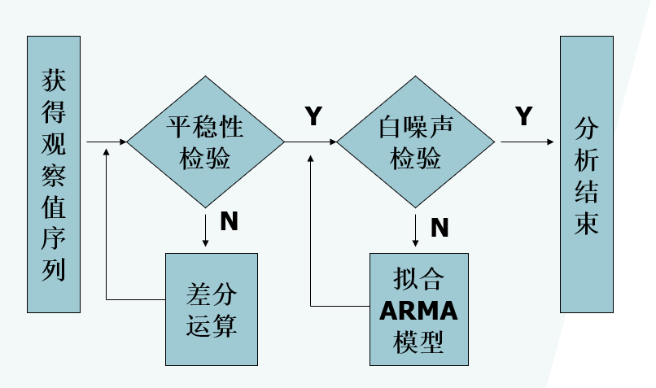
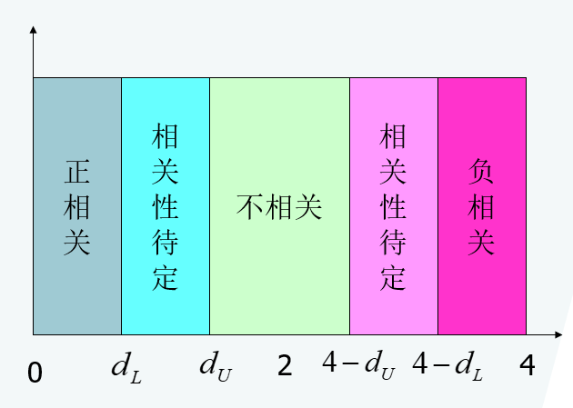

```{r setup, echo=F}
knitr::opts_knit$set(root.dir = getwd())
knitr::opts_chunk$set(echo = FALSE, results = 'hide')
knitr::opts_chunk$set(warning = FALSE, message=FALSE)
```

# 差分运算
## 差分运算的实质
差分方法是一种非常简便、有效的确定性信息提取方法。Cramer分解定理在理论上保证了**适当阶数的差分一定可以充分提取确定性信息**。

差分运算的实质是使用**自回归**的方式提取确定性信息  
\[{\nabla ^d}{x_t} = {(1 - B)^d}{x_t} = \sum\limits_{i = 0}^d {{{( - 1)}^i}C_d^i{x_{t - i}}} \]

它实质是一个d阶自回归过程
\[{x_t}{\rm{ = }}\sum\limits_{i = {\rm{1}}}^d {{{( - 1)}^{i{\rm{ + 1}}}}C_d^i{x_{t - i}}} {\rm{ + }}{\nabla ^d}{x_t}\]
用延迟1到d期的历史数据${\{x_{t-1}}\}、{\{x_{t-2}}\}\cdots {\{x_{t-d}}\}$作为自变量来解释当期序列值${\{x_t}\}$的变动状况，差分序列${\nabla ^d}{x_t}$度量的是${\{x_t}\}$d阶自回归过程中产生的随机误差的大小。

R中差分运算
```
diff(x,lag=,differences=)
-x:变量名
-lag:差分步长，默认为1
-differences:差分次数，默认为1
diff(x,d,k):进行k次d步差分
```
常用的差分运算相关命令
```
1阶差分:diff(x)
2阶差分:diif(x,1,2)
k阶差分:diff(x,1,k)
d步差分：diff(x,d,1)或diff(x,d)
一阶差分后再进行d步差分:diff(diff(x),d)
```
## 差分方式的选择

1. 序列蕴含着显著的线性趋势，一阶差分就可以实现趋势平稳
```{r}
a<-read.table("../习题数据、案例数据、R代码/data/file4.csv",sep=",",header = T)
x<-ts(a$output,start = 1964)
par(mfrow=c(1,2)) 
plot(x,main='原时序图')
x.dif<-diff(x)
plot(x.dif,main='1阶差分后')

```

 1阶差分运算成功从原序列中提取出线性趋势，差分后序列呈现出平稳随机波动。

2. 序列蕴含着曲线趋势，通常低阶（二阶或三阶）差分就可以提取出曲线趋势的影响 
```{r}
b<-read.table("../习题数据、案例数据、R代码/data/file15.csv",sep=",",header = T)
x<-ts(b$vehicle,start = 1950)
par(mfrow=c(2,2)) 
plot(x,main='原时序图')
#1阶差分，并绘制出差分后序列的时序图
x.dif<-diff(x)
plot(x.dif,main='1阶差分后')
#2阶差分，并绘制出差分后序列的时序图
x.dif2<-diff(x,1,2)
plot(x.dif2,main='2阶差分后')
x.dif3<-diff(x,1,3)
plot(x.dif2,main='3阶差分后')
```

1阶差分提取了原序列中部分长期趋势，但长期趋势信息提取不充分，仍蕴含长期递增趋势，再做1次差分，2阶差分比较充分的提取了原序列中蕴含的长期趋势，3阶差分基本无提取信息

3. 对于蕴含着固定周期的序列进行步长为周期长度的差分运算，通常可以较好地提取周期信息 
```{r}
c<-read.table("../习题数据、案例数据、R代码/data/file16.csv",sep=",",header = T)
x<-ts(c$export,start = c(2001,1),frequency = 12)
par(mfrow=c(2,2)) 
plot(x,main='原时序图')
#1阶差分，并绘制出差分后序列的时序图
x.dif<-diff(x)
plot(x.dif,main='1阶差分后')
#1阶差分加12步差分，并绘制出差分后序列的时序图
x.dif1_12<-diff(diff(x),12)
plot(x.dif1_12,main='1阶12步差分后')
```

时序图显示线性递增且周期长度为一年的稳定季节性变动，先做1阶差分提取线性递增趋势。1阶差分后呈现稳定的季节波动和随机波动，再进行12步的周期差分，提取季节波动信息。

## 过差分
从理论上而言，足够多次的差分运算可以充分地提取原序列中的非平稳确定性信息。但应当注意的是，差分运算的阶数并不是越多越好。因为差分运算是一种对信息的提取、加工过程，每次差分都会有信息的损失。在实际应用中差分运算的阶数得适当，应当避免过度差分的现象 。

假设序列如下
\[{x_t} = {\beta _0} + {\beta _1}t + {a_t}\]
\[E({a_t}) = 0,Var({a_t}) = {\sigma ^2},Cov({a_t},{a_{t - i}}) = 0,\forall i \ge 1\]
考察一阶差分后序列和二阶差分序列的平稳性与方差 

- 一阶差分

$\begin{array}{c}
\nabla {x_t} = {x_t} - {x_{t - 1}}\\
 = {\beta _1} + {a_t} - {a_{t - 1}}
\end{array}$ (平稳)

$\begin{array}{c}
Var(\nabla {x_t}) = Var({a_t} - {a_{t - 1}})\\
 = 2{\sigma ^2}
\end{array}$(方差小)

- 二阶差分（过差分）

$\begin{array}{c}
{\nabla ^2}{x_t} = \nabla {x_t} - \nabla {x_{t - 1}}\\
 = {a_t} - 2{a_{t - 1}} + {a_{t - 2}}
\end{array}$ (平稳)

$\begin{array}{c}
Var({\nabla ^2}{x_t}) = Var({a_t} - 2{a_{t - 1}} + {a_{t - 2}})\\
 = 6{\sigma ^2}
\end{array}$ (方差大)

过差分导致有效信息的无畏浪费而降低了估计的精度。

# ARIMA模型
对差分平稳序列可以使用ARIMA模型进行拟合

## ARIMA模型结构
具有如下结构的模型称为**求和自回归移动平均模型**，ARIMA(p,d,)
\[\left\{ \begin{array}{l}
\Phi (B){\nabla ^d}{x_t} = \Theta (B){\varepsilon _t}\\
E({\varepsilon _t}) = 0，Var({\varepsilon _t}) = \sigma _\varepsilon ^2,E({\varepsilon _t}{\varepsilon _s}) = 0,s \ne t\\
E{x_s}{\varepsilon _t} = 0,\forall s < t
\end{array} \right.\]

- ARIMA 模型族

d=0，ARIMA(p,d,q)=ARMA(p,q)

P=0，ARIMA(P,d,q)=IMA(d,q)

q=0，ARIMA(P,d,q)=ARI(p,d)

d=1,P=q=0，ARIMA(P,d,q)=random walk model(随机游走模型)

**随机游走模型( random walk)**

- 模型结构
\[\left\{ \begin{array}{l}
{x_t} = {x_{t - 1}} + {\varepsilon _t}\\
E({\varepsilon _t}) = 0，Var({\varepsilon _t}) = \sigma _\varepsilon ^2,E({\varepsilon _t}{\varepsilon _s}) = 0,s \ne t\\
E{x_s}{\varepsilon _t} = 0,\forall s < t
\end{array} \right.\]

- 模型使用场合

Karl Pearson(1905)在《自然》杂志上提问：假如有个醉汉醉得非常严重，完全丧失方向感，把他放在荒郊野外，一段时间之后再去找他，在什么地方找到他的概率最大呢？这个醉汉的行走轨迹就是一个随机游走模型。

传统的经济学家普遍认为投机价格的走势类似于随机游走模型，随机游走模型也是有效市场理论的核心。

## ARIMA模型性质
1. 平稳性

ARIMA(p,d,q)模型共有p+d个特征根，其中p个在单位圆内，d个在单位圆上。所以当 $d \ne 0$时，ARIMA(p,d,q)模型非平稳。

例：拟合随机游走序列ARIMA(0,1,0),$x_t=x_{t-1}+{\varepsilon _t},{\varepsilon _t}\sim NID(0,100)$
```{r}
x<-arima.sim(n=1000,list(order=c(0,1,0)),sd=10)
plot(x)
```

2. 方差齐性

对于ARIMA(p,d,q),当$d \ne 0$,不仅均值非齐性，序列方差也非齐性。

如随机游走模型ARIMA(0,1,0)
\[\begin{array}{l}
{x_t} = {x_{t - 1}} + {\varepsilon _t}\\
{\rm{   }} = {x_{t - 2}} + {\varepsilon _t} + {\varepsilon _{t - 1}}\\
{\rm{     }} \vdots \\
{\rm{   }} = {x_0} + {\varepsilon _t} + {\varepsilon _{t - 1}} +  \cdots  + {\varepsilon _1}\\
Var({x_t}) = Var({x_0} + {\varepsilon _t} + {\varepsilon _{t - 1}} +  \cdots {\varepsilon _1}) = t\sigma _\varepsilon ^2
\end{array}\]
随着时间趋向无穷，序列$\{ {x_t}\}$的方差也趋于无穷。

d阶差分后，$\begin{array}{l}
\nabla {x_t} = {\varepsilon _t}\\
Var(\nabla {x_t}) = Var({\varepsilon _t}) = \sigma _\varepsilon ^2
\end{array}$,差分后序列方差齐性

## ARIMA模型建模

```{r fig1,eval=T, echo=F,fig.cap="ARIMA建模步骤",dev="png",results='markup', cache=F}

```

## ARIMA模型预测
- 模型 
\[\Phi (B){(1 - B)^d}{x_t} = \Theta (B){\varepsilon _t}\]

- 原则：最小均方误差预测原理 

- Green函数递推公式
\[{x_t} = \Psi (B){\varepsilon _t}\]
\[\left\{ \begin{array}{l}
{\psi _1} = {\varphi _1} - {\theta _1}\\
{\psi _2} = {\varphi _1}{\psi _1} + {\varphi _2} - {\theta _2}\\
 \vdots \\
{\psi _j} = {\varphi _1}{\psi _{j - 1}} +  \cdots  + {\varphi _{p + d}}{\psi _{j - p - d}} - {\theta _j}
\end{array} \right.\]
其中令$\Phi (B){(1 - B)^d} = {\rm{1 - }}{\varphi _1}B{\rm{ - }}{\varphi _{\rm{2}}}{B^2} -  \cdots$

$x_{t+l}$真实值：

\[{x_{t + l}} = ({\varepsilon _{t + l}} + {\psi _1}{\varepsilon _{t + l - 1}} +  \cdots  + {\psi _{l - 1}}{\varepsilon _{t + 1}}) + ({\psi _l}{\varepsilon _t} + {\psi _{l + 1}}{\varepsilon _{t - 1}} +  \cdots )\\
={e_t}(l)+{\hat x_t}(l)\]


l期的预测值${\hat x_t}(l)$
$${\hat x_t}(l)={\psi _l}{\varepsilon _t} + {\psi _{l + 1}}{\varepsilon _{t - 1}} +  \cdots$$

l期的预测误差${e_t}(l)$
\[\begin{array}{l}
{e_t}(l) = {\varepsilon _{t + l}} + {\psi _1}{\varepsilon _{t + l - 1}} +  \cdots  + {\psi _{l - 1}}{\varepsilon _{t + 1}}\\
E[{e_t}(l)] = 0\\
Var[{e_t}(l)] = (1 + \psi _1^2 +  \cdots  + \psi _{l - 1}^2)\sigma _\varepsilon ^2
\end{array}\]

## R程序
```{r echo=TRUE}
#读入数据，并绘制时序图
d<-read.table("../习题数据、案例数据、R代码/data/file17.csv",sep=",",header = T)
x<-ts(d$index,start = 1952)
par(mfrow=c(1,2))
plot(x,main='时序图')
#1阶差分，并绘制出差分后序列的时序图
x.dif<-diff(x)
plot(x.dif,main='一阶差分序列时序图')
```

1阶差分后，线性趋势序列变为比较平稳的序列
```{r echo=TRUE}
#绘制差分后序列自相关图和偏自相关图
par(mfrow=c(1,2))
acf(x.dif)
pacf(x.dif)
```

自相关图显示除了延迟一阶的自相关系数显著非零，其他自相关系数均在2倍标准差内，具有很强的短期相关性，可认为1阶差分后平稳,偏相关系数1阶截尾初步确定拟合模型为ARIMA(0,1,1)
```{r echo=TRUE}
#拟合ARIMA(0,1,1)模型
x.fit<-arima(x,order=c(0,1,1))
x.fit
#残差白噪声检验
for(i in 1:2) print(Box.test(x.fit$residual,lag=6*i))
```
$$x_t=x_{t-1}+{\varepsilon _t}+0.7355{\varepsilon _{t-1}}, {\varepsilon _t}\sim N(61.59)$$
残差序列白噪声检验未通过，说明该模型显著成立，ARIMA(0,1,1)模型对该序列拟合成功。

```{r echo=TRUE}
#预测
library(zoo)
library(forecast)
x<-ts(d$index,start = 1952)
x.fit<-arima(x,order=c(0,1,1))
x.fore<-forecast(x.fit,h=10)
plot(x.fore)
```

## 疏系数模型
ARIMA(p,d,q)模型是指d阶差分后自相关最高阶数为p，移动平均最高阶数为q的模型，通常它包含p+q个独立的未知系数：${\phi _1}, \cdots ,{\phi _p},{\theta _1}, \cdots ,{\theta _q}$

如果该模型中有部分自相关系数${\phi _j},1 \le j < p$或部分移动平滑系数     ${\theta _k},1 \le k<q$为零，即原模型中有部分系数省缺了，那么该模型称为疏系数模型。

如果只是自相关部分有省缺系数，那么该疏系数模型可以简记为$ARIMA(({p_1}, \cdots ,{p_m}),d,q)$

- ${p_1}, \cdots ,{p_m}$为非零自相关系数的阶数

如果只是移动平滑部分有省缺系数，那么该疏系数模型可以简记为$ARIMA(p,d,({q_1}, \cdots ,{q_n}))$

- ${q_1}, \cdots ,{q_n}$为非零移动平均系数的阶数

如果自相关和移动平滑部分都有省缺，可以简记为$ARIMA(({p_1}, \cdots ,{p_m}),d,({q_1}, \cdots ,{q_n}))$

arima函数拟合ARIMA疏系数模型
```
arima(x,order=c(p,d,q),include.mean=,method=,transform.pars=,fixed=)
-method:指定参数估计方法
-transform.pars:指定参数估计方法是否由系统自动完成。
=T:系统默认设置，根据order选项设置的模型阶数自动完成参数估计
=F:需要拟合疏系数模型
-fixed:对疏系数模型指定疏系数的位置
```

## 季节模型
### 简单季节模型
简单季节模型是指序列中的季节效应和其它效应之间是加法关系
\[{x_t} = {S_t} + {T_t} + {I_t}\]

简单季节模型通过简单的趋势差分、季节差分之后序列即可转化为平稳，它的模型结构通常如下 
\[{\nabla _D}{\nabla ^d}{x_t} = \frac{{\Theta (B)}}{{\Phi (B)}}{\varepsilon _t}\]
式中，D为周期步长，d为提取趋势信息所用的差分阶数
```
arima(x,order=c(p,d,q),include.mean=,method=,transform.pars=,fixed=,seasonal=)
-seasonal:指定季节模型的阶数与季节周期
seasonal=list(order=c(P,D,Q),period=π)
加法模型：P=0,Q=0
乘法模型：P,Q不全为零
```
### 乘积季节模型 
- 使用场合

序列的季节效应、长期趋势效应和随机波动之间有着复杂地相互关联性，简单的季节模型不能充分地提取其中的相关关系 

- 构造原理

短期相关性用低阶ARMA(p,q)模型提取，季节相关性用以周期步长S为单位的ARMA(P,Q)模型提取

假设短期相关和季节效应之间具有乘积关系，模型结构如下
 \[{\nabla ^d}\nabla _S^D{x_t} = \frac{{\Theta (B)}}{{\Phi (B)}}\frac{{{\Theta _S}(B)}}{{{\Phi _S}(B)}}{\varepsilon _t}\]
式中 
$$\begin{array}{l}{\Theta(B)=1-\theta_{1} B-\cdots-\theta_{q} B^{q}} \\ {\Phi(B)=1-\phi_{1} B-\cdots-\phi_{p} B^{p}} \\ {\Theta_{S}(B)=1-\theta_{1} B^{S}-\cdots-\theta_{Q} B^{Q S}} \\ {\Phi_{S}(B)=1-\phi_{1} B^{S}-\cdots-\phi_{P} B^{P S}}\end{array}$$
该乘积模型简记为ARIMA(p,d,q)x(P,D,Q)s

# 残差自回归(Auto-Regressive)模型
## 模型结构
- 构造思想

首先通过**确定性因素分解方法**提取序列中主要的确定性信息：
\[{x_t} = {T_t} + {S_t} + {\varepsilon _t}\]
式中，$T_t$为趋势效应拟合，$S_t$为季节效应拟合

然后对残差序列拟合自回归模型，以便充分提取相关信息 
\[{\varepsilon _t} = {\phi _1}{\varepsilon _{t - 1}} +  \cdots  + {\phi _p}{\varepsilon _{t - p}} + {a_t}\]

- (残差)自回归模型(auto-regressive model)

\[\left\{ \begin{array}{l}
  {x_t} = {T_t} + {S_t} + {\varepsilon _t}\\
{\varepsilon _t} = {\phi _1}{\varepsilon _{t - 1}} +  \cdots  + {\phi _p}{\varepsilon _{t - p}} + {a_t}\\
E({a_t}) = 0,Var({a_t}) = {\sigma ^2},Cov({a_t},{a_{t - i}}) = 0,\forall i \ge 1
\end{array} \right.\]

- 对趋势效应的常用拟合方法

（1）自变量为时间t的幂函数
\[{T_t} = {\beta _0} + {\beta _1} \cdot t +  \cdots  + {\beta _k} \cdot {t^k} + {\varepsilon _t}\]

（2）自变量为历史观察值${x_{t-1},x_{t-2},\cdots,x_{t-k}}$
  \[{T_t} = {\beta _0} + {\beta _1} \cdot {x_{t - 1}} +  \cdots  + {\beta _k} \cdot {x_{t - k}} + {\varepsilon _t}\]

- 对季节效应的常用拟合方法

（1）给定季节指数
\[{S_t} = {S'_t}\]
式中，$S'_t$是某个已知的季节指数
  
（2）建立季节自回归模型
\[{S_t} = {\alpha _0} + {\alpha _1} \cdot {x_{t - m}} +  \cdots  + {\alpha _l} \cdot {x_{t - lm}}\]
式中，假定固定周期为m
  
## 残差自相关检验
### 检验原理
回归模型拟合充分，残差的性质
\[E({\varepsilon _t},{\varepsilon _{t - j}}) = 0， \forall j \ge 1\]
  
回归模型拟合得不充分，残差的性质
\[E({\varepsilon _t},{\varepsilon _{t - j}}) \ne ，j \ge 1\]
  
### Durbin-Waston检验（DW检验） 
- 假设条件
  
原假设：残差序列不存在一阶自相关性 
\[{H_0}:E({\varepsilon _t},{\varepsilon _{t - 1}}) = 0 \Leftrightarrow {H_0}:\rho  = 0\]
  
备择假设：残差序列存在一阶自相关性 
  \[{H_0}:E({\varepsilon _t},{\varepsilon _{t - 1}}) \ne 0 \Leftrightarrow {H_0}:\rho  \ne 0\]
  
- 检验统计量 （自变量独立）
  
\[DW = \frac{{\sum\limits_{t = 2}^n {{{({\varepsilon _t} - {\varepsilon _{t - 1}})}^2}} }}{{\sum\limits_{t = 1}^n {\varepsilon _t^2} }}\]
  
DW统计量和自相关系数的关系
\[DW \cong 2\left( {1 - \rho } \right)\]
  
- DW统计量的判定结果
  
```{r fig2,eval=T, echo=F,fig.cap="DW统计量的判定",dev="png",results='markup', cache=F}

```
  
- R函数
  
```
library(lmtest)
dwtest(x.fit)
```
### Durbin h检验 
- DW统计量的缺陷
  
当回归因子包含延迟因变量时(内生变量)，残差序列的DW统计量是一个有偏统计量。在这种场合下使用DW统计量容易产生残差序列正自相关性不显著的误判。基于这个原因，在ARIMA模型中，我们使用Durbin h检验
  
- Durbin h检验(自变量与因变量具有相关关系时)
  
\[Dh = DW\frac{n}{{1 - n\sigma _\beta ^2}}\]
  
- R函数
  
```
dwtest(x.fit,order.by=xlag)
order.by:指定延迟因变量
```
  
## 残差自相关模型拟合
当残差自相关检验显示残差序列高度自相关时，我们需要对残差序列进行二次拟合，对第一次确定性拟合模型的残差序列拟合自相关模型，进一步提取残差序列中的信息。拟合残差自相关模型步骤与命令和构建ARIMA模型的步骤和命令一样。

# 异方差的性质
## 异方差的定义
- 如果随机误差序列的方差会随着时间的变化而变化，这种情况被称作为异方差
$$Var({\varepsilon _t}) = h(t)$$

## 异方差的影响
- 忽视异方差的存在会导致残差的方差会被严重低估，继而参数显著性检验容易犯纳伪错误，这使得参数的显著性检验失去意义，最终导致模型的拟合精度受影响。 

## 异方差处理方法
- 假如已知异方差函数具体形式，进行方差齐性变化
- 假如不知异方差函数的具体形式，拟合条件异方差模型 

# 方差齐性变换
## 使用场合
- 序列显示出显著的异方差性，且方差与均值之间具有某种函数关系$$\sigma _t^2 = h({\mu 
_t})$$其中:$h(.)$是某个已知函数


## 处理思路
- 尝试寻找一个转换函数$g(.)$，使得经转换后的变量满足方差齐性
$$Var[g({x_t})] = {\sigma ^2}$$
- 转换函数$g(x_t)$在$μ_t$近作一阶泰勒展开
$$g({x_t}) \cong g({\mu _t}) + ({x_t} - {\mu _t})g'({\mu _t})$$
- 求转换函数的方差
$$\begin{array}{l}
Var[g({x_t})] \cong Var[g({\mu _t}) + ({x_t} - {\mu _t})g'({\mu _t})]\\
{\kern 1pt} {\kern 1pt} {\kern 1pt} {\kern 1pt} {\kern 1pt} {\kern 1pt} {\kern 1pt} {\kern 1pt} {\kern 1pt} {\kern 1pt} {\kern 1pt} {\kern 1pt} {\kern 1pt} {\kern 1pt} {\kern 1pt} {\kern 1pt} {\kern 1pt} {\kern 1pt} {\kern 1pt} {\kern 1pt} {\kern 1pt} {\kern 1pt} {\kern 1pt} {\kern 1pt} {\kern 1pt} {\kern 1pt} {\kern 1pt} {\kern 1pt} {\kern 1pt} {\kern 1pt} {\kern 1pt} {\kern 1pt} {\kern 1pt} {\kern 1pt} {\kern 1pt} {\kern 1pt} {\kern 1pt} {\kern 1pt} {\kern 1pt} {\kern 1pt} {\kern 1pt} {\kern 1pt} {\kern 1pt} {\kern 1pt} {\kern 1pt} {\kern 1pt} {\kern 1pt} {\kern 1pt} {\kern 1pt} {\kern 1pt} {\kern 1pt} {\kern 1pt} {\kern 1pt}  = {[g'({\mu _t})]^2}h({\mu _t})
\end{array}$$
- 转换函数的确定
$$g'({\mu _t}) = \frac{1}{{\sqrt {h({\mu _t})} }}$$
- 在实践中，许多金融时间序列都呈现出异方差的性质，而且通常序列的标准差与其水平之间具有某种正比关系，即序列的水平低时，序列的波动范围小，序列的水平高时，序列的波动范围大。对于这种异方差的性质，最简单的假定为
$${\sigma _t} = {\mu _t} \Leftrightarrow h({\mu _t}) = \mu _t^2$$
- 转换函数的确定
$$g'({\mu _t}) = \frac{1}{{\sqrt {h({\mu _t})} }} = \frac{1}{{{\mu _t}}}{\kern 1pt} {\kern 1pt} {\kern 1pt} {\kern 1pt} {\kern 1pt} {\kern 1pt} {\kern 1pt} {\kern 1pt} {\kern 1pt} {\kern 1pt} {\kern 1pt}  \Rightarrow {\kern 1pt} {\kern 1pt} {\kern 1pt} {\kern 1pt} {\kern 1pt} {\kern 1pt} {\kern 1pt} {\kern 1pt} {\kern 1pt} g({\mu _t}) = \log ({\mu _t})$$

# 条件异方差模型
## 条件异方差模型的提出
- 方差齐性变换为异方差序列的精确拟合提供了一个很好的解决方法，但要使用方差齐性变换必须得事先知道异方差函数的形式，而这通常是不可能的。
- 实践中，在进行金融时间序列分析时，由于金融序列的标准差与水平之间通常具有某种正相关关系，所以异方差函数经常被假定为
$$h({\mu _t}) = \mu _t^2$$继而导致对数变换在进行金融时间序列分析时被普遍采用。
- 但大量的实践证明这种假定太简单化了,对数变换通常只适用于方差随均值变化而变化的部分序列。异方差的特征千变万化,对数变换并不能将所有的异方差序列转换为方差齐性。本节介绍一种在宏观经济领域和金融领域被广泛采用的异方差处理方法：条件异方差模型。

## 集群效应
- 在宏观经济领域或者是金融领域，经常可以看到具有如下特征的时间序列。
- 它们在消除确定性非平稳因素的影响之后，残差序列的波动在大部分时段是平稳的，但却会在某些时段波动持续偏高，在某些时段波动持续偏低，呈现出集群效应（volatility cluster）。

```{r}
#读入数据，并绘制时序图
k<-read.table("../习题数据、案例数据、R代码/data/file22.csv",sep=",",header = T)
x<-ts(k$returns,start = c(1926,1),frequency = 12)
par(mfrow=c(1,2))
plot(x,main='时序图')
#绘制序列平方图
plot(x^2,main='序列平方图')
```

时序图显示该序列没有显著的非平稳特征。序列围绕在零值附近波动，大部分时期波动范围在-0.1~0.1之间。
但是在一些特殊时段：比如1930年前后、1940年前后、1975年前后、以及1990年前后，序列的波动大起大落。这就是集群效应特征。平方图更加明显看出上述几个时期的方差显著异于期望方差。

## 集群效应的影响
- 我们通常用方差来描述序列的波动，集群效应就意味着从整个序列观察期而言，序列的方差是基本齐性的，但在某一段或某几段时期方差却显著异于期望方差。
- 这种序列波动特征给从事利率、汇率、通货膨胀率、股票价格指数等金融时间序列预测的研究人员带来了很大的困惑，因为基于方差齐性得到的置信区间在集群效应存在时是不准确的。他们对这些变量的预测能力随着时期的不同而有相当大的变化。
- 对于资产持有者而言，他们并不关心资产收益率在所有时段的综合表现，他们关注的是在它们持有资产的这段时间，资产收益率会不会有大的波动。基于序列全程方差齐性的分析方法无法满足他们的分析需要，这时需要使用能考虑集群效应的新模型，即条件异方差模型。

## ARCH模型
- 自回归条件异方差模型的全称是Autoregressive Conditional Heteroskedastic，有时简称为条件异方差模型或ARCH模型。它是Engle于1982年在分析英国通货膨胀率序列时提出的残差平方自回归模型。

### ARCH模型构造原理
- 在方差非齐的残差序列中，蕴含着某种相关信息，我们可以通过构造适当的模型，提取这些相关信息，以获得序列异方差波动特征。

### ARCH模型的结构
$${h_t} = E(\varepsilon _t^2) = \omega  + \sum\limits_{j = 1}^q {{\lambda _j}\varepsilon _{t - j}^2} $$

### 对序列的水平建模
- 对一个时间序列，我们通常关注两个最关键的条件统计量：

（1）在历史信息已知情况下，该序列的条件水平
\[{\mu _t} = E({y_t}\left| {{y_{t - 1}}} \right.,{y_{t - 2}}, \cdots )\]

- 前面学过的ARIMA模型，残差自回归模型，确定性因素分解模型等都属于对序列的水平进行建模。这些模型主要拟合并预测序列的平均水平会发生怎样的变化。

### 对序列的波动性建模
- 因为水平只是一个点估计，无法给出估计精度，所以通常我们还需要关注序列的波动，估计出置信区间。所以对一个时间序列，我们还关注另一个关键的条件统计量是：

（2）在历史信息已知情况下，该序列的条件波动
\[\sigma _t^2 = Var({y_t}\left| {{y_{t - 1}}} \right.,{y_{t - 2}}, \cdots )\]

- 以前我们求置信区间时，都假定残差序列方差齐性。这种假定在异方差场合就会出现问题。如果序列残差具有集群效应，且近期正处于大起大落的那段时期，那么这段时间的真实方差通常就比齐性方差大。这时，按照方差齐性的假定估计的95%的置信区间，它的真实置信水平一定低于95%。而ARCH模型就是要构造一个模型，利用历史信息，得到条件方差信息
$$Var{\rm{(}}{\varepsilon _t}\left| {{\varepsilon _{t{\rm{ - }}1}}{\rm{,}}} \right.{\varepsilon _{t{\rm{ - 2}}}}{\rm{,}} \cdots {\rm{) = }}E(\varepsilon _t^2\left| {{\varepsilon _{t{\rm{ - }}1}}{\rm{,}}} \right.{\varepsilon _{t{\rm{ - 2}}}}{\rm{,}} \cdots ) = \omega  + \sum\limits_{j = 1}^q {{\lambda _j}\varepsilon _{t - j}^2}$$

### ARCH模型的完整结构
- 当我们拿到一个观察值序列，完整的分析应该是水平和波动两方面都关注。我们通常会首先提取序列的水平相关信息，然后分析残差序列中蕴含的波动相关信息。这两方面的信息综合起来才是比较完整和精确的分析。
- 所以使用ARCH模型提取异方差中蕴含的相关信息的完整结构为
$$\begin{array}{l}
{x_t} = f(t,{x_{t - 1}},{x_{t - 2}}, \cdots ) + {\varepsilon _t}\\
{\varepsilon _t} = \sqrt {{h_t}} {e_t}{\kern 1pt} {\kern 1pt} {\kern 1pt} {\kern 1pt} {\kern 1pt} {\kern 1pt} {\kern 1pt} {\kern 1pt} {\kern 1pt} {\kern 1pt} {\kern 1pt} {\kern 1pt} {\kern 1pt} {\kern 1pt} {\kern 1pt} {e_t}\mathop \sim\limits^{i.i.d} N(0,{\sigma ^2})\\
{h_t} = \omega  + \sum\limits_{j = 1}^q {{\lambda _j}\varepsilon _{t - j}^2} 
\end{array}$$

### ARCH检验
#### 检验目的：
- 要拟合ARCH模型，首先需要进行ARCH检验。ARCH检验是一种特殊的异方差检验，它不仅要检验序列具有异方差性，而且还要求这种异方差性是由某种自相关关系造成的，这种自相关关系，可以用残差序列的自回归模型进行拟合。
- 常用的检验统计量

Portmantea Q检验（Mcleod & Li,1983)

拉格朗日乘子（LM）检验 (Engle,1982)

#### Portmantea Q检验
- 构造思想

若残差序列方差非齐性，且具有集群效应，那么残差平方序列通常具有自相关性，所以残差非齐性检验可以转化为残差平方序列的自相关性检验。

- 假设条件

${H_0}:残差平方序列非随机(方差齐性)\leftrightarrow {H_1}:残差平方序列自相关(方差非齐性)$

用${{\rho _k}}$表示残差平方序列$\left\{ {\varepsilon _t^2} \right\}$的延迟k阶自相关系数，则等价假设条件为：

${H_0}:{\rho _1} = {\rho _2} =  \cdots  = {\rho _q} = 0 \leftrightarrow {H_1}:{\rho _1},{\rho _2}, \cdots ,{\rho _q}不全为零$

- 检验统计量
\[Q(q) = n(n + 2)\sum\limits_{i = 1}^q {\frac{{\rho _i^2}}{{n - i}}} \sim {\chi ^2}(q - 1)\]

- 检验结果

拒绝原假设:$Q(q)\mathop  \ge \limits^ \cdot  \chi _{1 - \alpha }^2(q - 1)$

接受原假设:$Q(q)\mathop  < \limits^ \cdot  \chi _{1 - \alpha }^2(q - 1)$

- R函数

对残差序列进行平方运算后，调用Box.test函数完成Portmantea Q检验
```
for(i in 1:2) print(Box.test(x^2,lag=i))
```


#### LM检验
- 构造思想

假如残差序列方差非齐，且具有集群效应，那么残差平方序列通常具有自相关性。那么我们就可以尝试使用自回归模型（ARCH(q)模型）拟合残差平方序列，于是方差齐性检验就可以转化为这个方程是否显著成立的检验。
\[\varepsilon _t^2 = \omega  + \sum\limits_{j = 1}^q {{\lambda _j}\varepsilon _{t - j}^2} \, + {e_t}{\kern 1pt} \]

如果方程显著成立（至少存在一个参数非零），那就意味着残差平方序列具有自相关性，可以用该回归方程提取自相关信息。反之，如果方差不能显著成立，那就意味着残差平方序列不存在显著的自相关性，不能拒绝方差齐性假定。所以拉格朗日乘子检验实际上就是残差平法序列自回归的方程显著性检验。

- 假设条件

${H_0}:残差平方序列非随机\leftrightarrow {H_1}:残差平方序列自相关$

${H_0}:{\lambda _1} = {\lambda _2} =  \cdots  = {\lambda _q} = 0 \leftrightarrow {H_1}:{\lambda _1},{\lambda _2}, \cdots {\lambda _q}不全为零$

- 检验统计量
\[LM(q) = \frac{{(SST - SSE)/q}}{{SSE/(t - 2q - 1)}}\]

- 检验结果

拒绝原假设:$LM(q)\mathop  \ge \limits^ \cdot  \chi _{1 - \alpha }^2(q - 1)$

接受原假设:$LM(q)\mathop  < \limits^ \cdot  \chi _{1 - \alpha }^2(q - 1)$

- R函数

```
install.packages('FinTS')
library(FinTS)
ArchTest函数做LM检验
```
## GARCH模型


