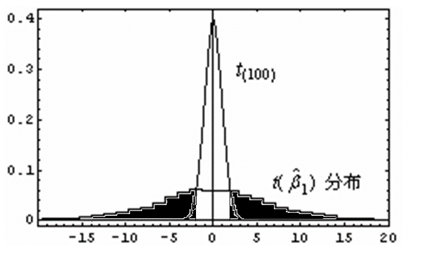

# 平稳多元序列建模
1. 动态回归模型(ARIMAX)模型结构
$$\left\{ \begin{array}{l}
{y_t} = \mu  + \sum\limits_{k = 1}^k {\frac{{{\Theta _i}(B)}}{{{\Phi _i}(B)}}{B^{{l_i}}}{x_{it}}}  + {\varepsilon _t}\\
{\varepsilon _t} = \frac{{\Theta (B)}}{{\Phi (B)}}{a_t}
\end{array} \right.$$

2. 协相关图
```{r}
ccf(mdeaths, fdeaths, ylab = "cross-correlation")
```
ccf函数中x序列和y序列的位置可以随意放置，协相关图形状不变。ccf(x,y)表示x比y滞后的情况，ccf(y,x)表示y比x滞后的情况。

# 虚假回归
1. 假设条件
${H_0}:{\beta _1} = 0 \leftrightarrow {H_1}:{\beta _1} \ne 0$
2. 检验统计量
$t = \frac{{{\beta _1}}}{{{\sigma _\beta }}}$
3. 虚假回归
$$\Pr \{ \left| t \right| \le {t_{{\alpha  \mathord{\left /
{\vphantom {\alpha  2}} \right.
\kern-\nulldelimiterspace} 2}}}(n)\left| \text{非平稳序列} \right.\}  \ge \alpha $$
 
4. 伪回归随机模拟实验
1974年，Granger和Newbold进行了非平稳序列伪回归的随机模拟试验，检验结果说明在非平稳的场合，参数显著性检验犯第一类错误的概率远远大于显著性水平，伪回归显著成立。这导致多元非平稳序列的分析埋有隐患。
- 试验设计思想
分别拟合两个随机游走序列：
$$(1){\kern 1pt} {\kern 1pt} {\kern 1pt} {\kern 1pt} {y_t} = {y_{t - 1}} + {\omega _t}{\kern 1pt} {\kern 1pt} {\kern 1pt} {\kern 1pt} {\kern 1pt} {\kern 1pt} {\kern 1pt} {\kern 1pt} {\kern 1pt} {\kern 1pt} {\kern 1pt} {\kern 1pt} {\kern 1pt} {\kern 1pt} {\kern 1pt} {\kern 1pt} {\kern 1pt} {\kern 1pt} {\kern 1pt} {\kern 1pt} {\kern 1pt} {\kern 1pt} {\kern 1pt} {\kern 1pt} {\kern 1pt} {\kern 1pt} {\kern 1pt} {\kern 1pt} (2){\kern 1pt} {\kern 1pt} {\kern 1pt} {\kern 1pt} {x_t} = {x_{t - 1}} + {\upsilon _t}$$
其中：${\omega _t}\mathop {\rm{\~}}\limits^{iid} N{\rm{(}}0{\rm{,}}\sigma _\omega ^2{\rm{),}}{\upsilon _t}\mathop {\rm{\~}}\limits^{iid} N{\rm{(}}0{\rm{,}}\sigma _\upsilon ^2{\rm{),}}\text{且}Cov({\omega _t},{\upsilon _s}) = 0,{\kern 1pt} {\kern 1pt} {\kern 1pt} {\kern 1pt} {\kern 1pt} {\kern 1pt} {\kern 1pt} {\kern 1pt} {\kern 1pt} {\kern 1pt} {\kern 1pt} \forall t,s \in T$
构建关于的回归模型：${y_t} = {\beta _0} + {\beta _1}{x_t} + {\varepsilon _t}$，并进行参数显著性检验。
- 试验结果
由于这是两个独立的随机游走模型，所以理论上它们应该没有任何相关性，即模型检验应该显著支持${\beta_1}{\rm{ = }}0$的假设。如果模拟结果显示拒绝原假设的概率远远大于拒真概率$\alpha$，即认为伪回归显著成立。
大量随机拟合的结果显示，每100次回归拟合中，平均有75次拒绝${\beta_1}{\rm{=}}0$的假设，拒真概率高达75%。这说明在非平稳的场合，参数显著性检验犯拒真错误的概率远远大于$\alpha$，伪回归显著成立。
- 伪回归产生原因


